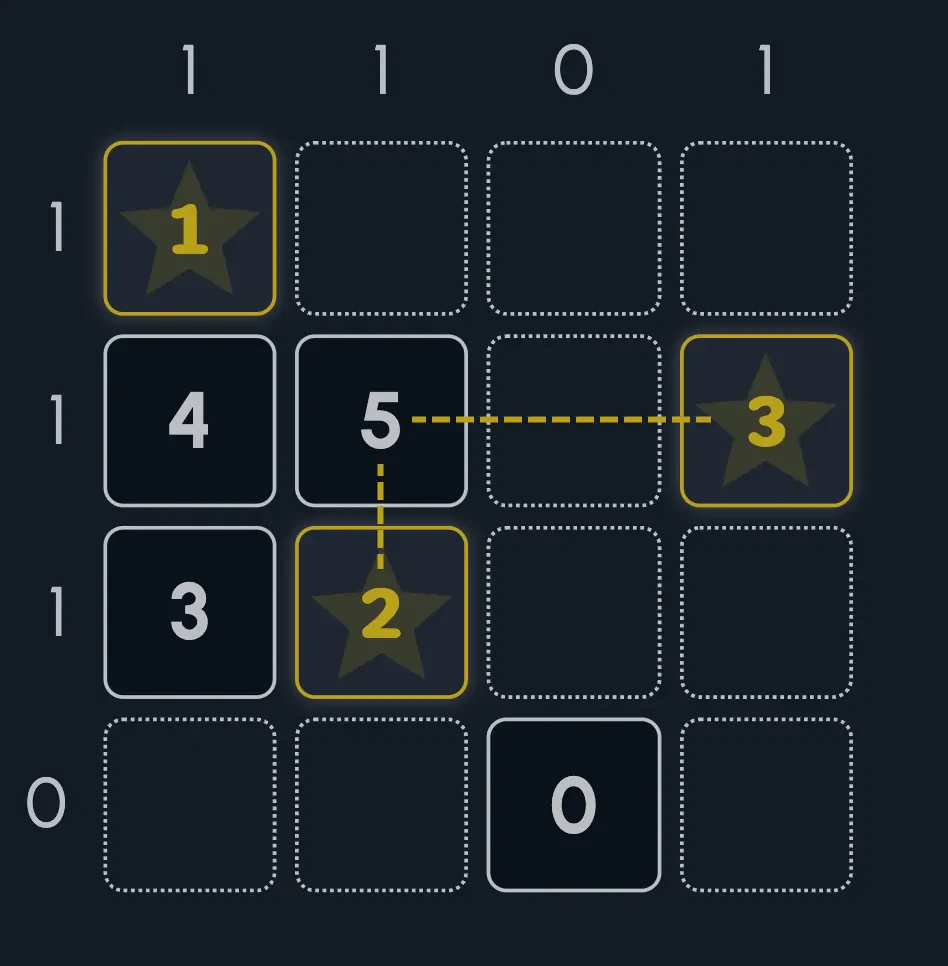
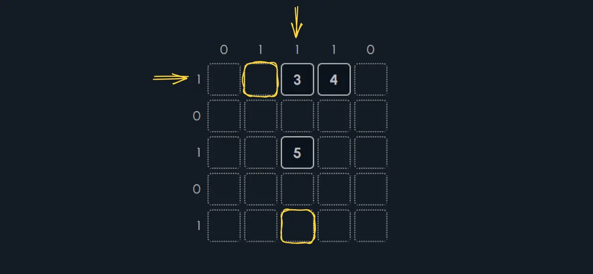
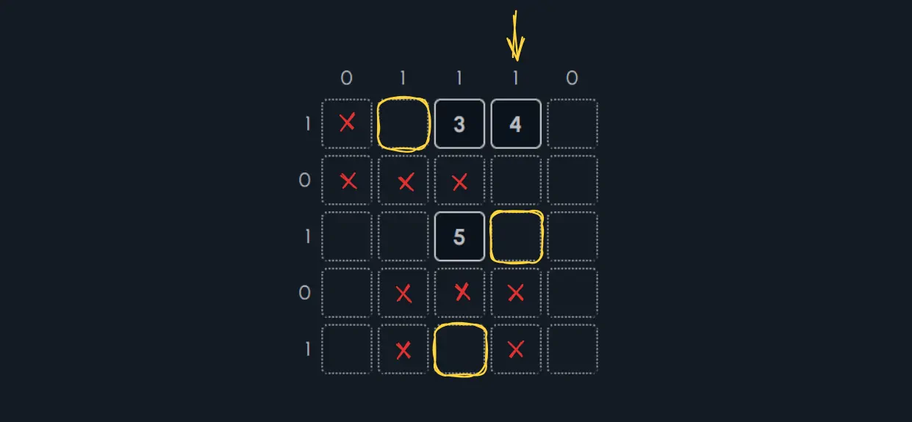
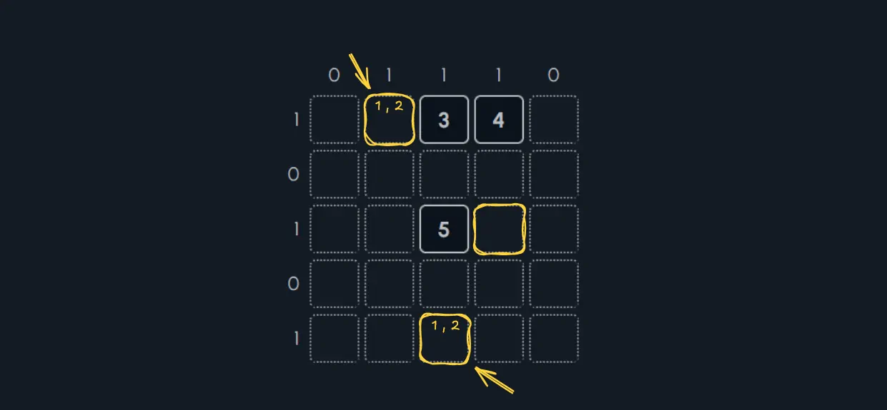
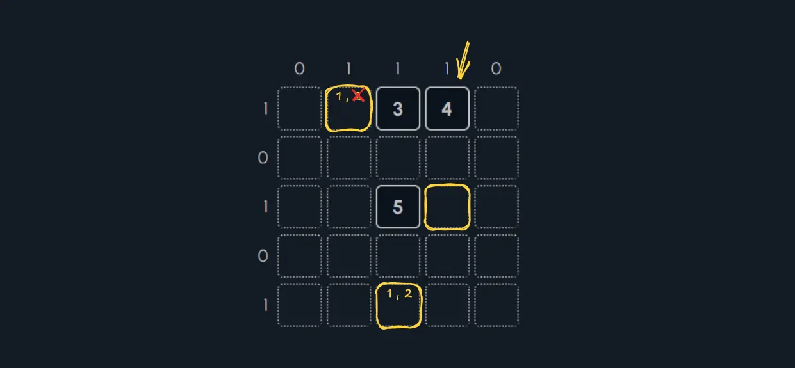
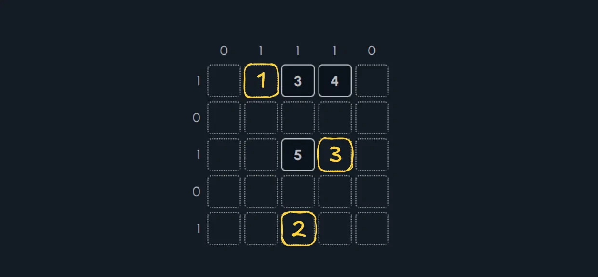
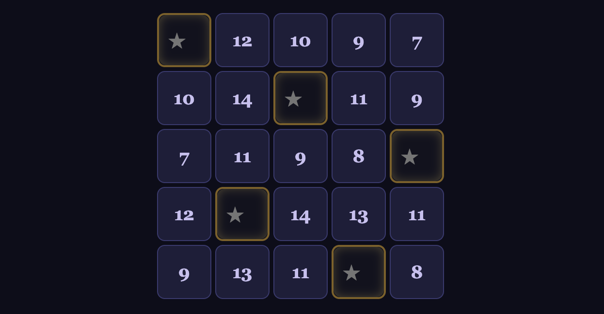

This is Part 1(?) of a weekly series where I'll be probing **Artificial Creativty**. Weekly is pretty ambitious of me, but I think I can do it if I'm willing to think of my posts as documenting a journey rather than a destination.

This week, I randomly asked Gemini and Claude to invent an entirely new category of puzzle, and that sent me down a rabbit hole of experimentations where I realized I might be able to probe AI's propensity for creativity. I studied creativity in college, so besides the head knowledge that I have on the subject, I've also got some pent-up curiosity. Is AI currently creative? In what ways is it different from human creativity? This is what I'll be investigating in the coming weeks.

After playing a bit, my personal takeaway was this:

<major-point>

Creativity is a process, not a revelation.

</major-point>

Let's look at Gemini's bad puzzle, Claude's much better puzzle, and how this demonstrates the stark difference in quality when just a tiny bit of process is added. Or... [skip directly to the good puzzle](#claudes-puzzle-luminary) (:

> [!TIP]
> Creativity is not the same as _artistry_. Human artistry is a means of personal expression and _can't_ (at least _shouldn't_) be replicated by AI. **Creativity is the intersection of novelty and purpose**, and is applicable to many things: solving problems in new ways, combining two disparate domains of knowledge, bridging artistic media, etc.
> 
> AI has a reputation for generating "slop", and slop is almost by definition uncreative. But that doesn't mean AI _can't be_ creative, or aid in creative processes. This is what I'm curious about.


## Gemini's "Puzzle": Fulcrum Drift

So, Gemini invented _something_. Whether it is truly novel is hard to validate practically, but I bet it's more novel than not. Why? Because the puzzle wasn't fun (:

But we'll discuss "funness" later. For now, behold **Fulcrum Drift**:

- You are given a balancing beam with a certain number of slots.
- You must place into the slots some letters (twice each), and a Fulcrum Δ.
- For each letter, you are given a number called "Drift".
- Drift roughly represents how out-of-balance the letter is on the beam. If each position on the beam is labeled starting at 1, then mathematically Drift equals <math-inline tex="\left| P_1 + P_2 - 2F \right|"></math-inline>, where the P's are the positions of the letters, and F the position of the fulcrum.
- Using the Drift values, you must ascertain where on the beam the letters are, along with the Fulcrum.

### Example Puzzle

Here's an example. You have a size-7 beam, and must place two of each of the letters A, B, and C, as well as a fulcrum, onto the beam.

```
[ _ ] [ _ ] [ _ ] [ _ ] [ _ ] [ _ ] [ _ ]
  1     2     3     4     5     6     7
```

The drift values are as follows:

1. The Drift of A is **1**.
2. The Drift of B is **5**.
3. The Drift of C is **1**.

Find where the letters A, A, B, B, C, C, and the Fulcrum Δ go.

### Solving the Puzzle

This is my best way to describe how to solve the puzzle without devolving into a series of equations. Basically, think of Drift values as "puzzle pieces", then try to fit them together onto the beam.

<slide-show style="margin-block-start: 0;">
	<figure slot="slide">
		<pre style="margin-block-end: 0;"><code>
[ _ ] [ _ ] [ _ ] [ _ ] [ _ ] [ _ ] [ _ ]
  1     2     3     4     5     6     7
		</code></pre>
		<p style="margin-block-start: 0; font-size: 0.875em;">Drift of A = 1 • Drift of B = 5 • Drift of C = 1</p>
		<figcaption>Let's start by considering what the possible <em>shapes</em> of numbers are for particular Drift values. Let's represent that with N being the letter and Δ being the fulcrum. A <code>*</code> represents any number of blanks on each side of the Fulcrum (but they must be the <em>same</em> number of blanks).<br /><br />Drift 1: <code>N * Δ * _ N</code><br /><br />Drift 5: <code>Δ * N _ _ N</code> OR <code>N * Δ * _ _ _ _ _ N</code></figcation>
	</figure>
	<figure slot="slide">
		<pre style="margin-block-end: 0;"><code>
[ _ ] [ _ ] [ _ ] [ _ ] [ _ ] [ _ ] [ _ ]
  1     2     3     4     5     6     7
		</code></pre>
		<p style="margin-block-start: 0; font-size: 0.875em;">Drift of A = 1 • Drift of B = 5 • Drift of C = 1</p>
		<figcaption>It is not possible to fit the second configuration of Drift 5, since there are not enough slots.<br />Therefore, we need to fit two of <code>N * Δ * _ N</code> and one of <code>Δ * N _ _ N</code> onto the beam.</figcation>
	</figure>
	<figure slot="slide">
		<pre style="margin-block-end: 0;"><code>
[ _ ] [ _ ] [ Δ ] [ _ ] [ _ ] [ _ ] [ _ ]
  1     2     3     4     5     6     7
		</code></pre>
		<p style="margin-block-start: 0; font-size: 0.875em;">Drift of A = 1 • Drift of B = 5 • Drift of C = 1</p>
		<figcaption>This allows us to deduce that the Fulcrum is at slot 3. If it was at slot 4, then we couldn't fit the pattern for drift 5. If it was at slot 1 or 2, then we couldn't ever fit both patterns of drift 1.</figcation>
	</figure>
	<figure slot="slide">
		<pre style="margin-block-end: 0;"><code>
[ A ] [ C ] [ Δ ] [ B ] [ C ] [ A ] [ B ]
  1     2     3     4     5     6     7
		</code></pre>
		<p style="margin-block-start: 0; font-size: 0.875em;">Drift of A = 1 • Drift of B = 5 • Drift of C = 1</p>
		<figcaption>The Drift 5 pattern is forced. And the other two letters just slot in.</figcation>
	</figure>
</slide-show>


### Why Fulcrum Drift is not fun

Technically this is an opinion, but I do believe there are certain qualities that make puzzles in general "good" and others "bad".

- **Solution Uniqueness**: A good logic puzzle should have exactly one unique, unambiguous solution. Every single Fulcrum Drift puzzle fails this. Simply mirror the solution and you get a second solution. And when two Drift values are the same, then those letters are effectively interchangeable in the solution.
- **Logic Diversity**: Solving the puzzle should involve multiple kinds of deductions. Deploying the right kind of deduction at the right moment is what makes a puzzle fun. Fulcrum Drift is just a math equation. Drift values tell you how far apart numbers are, then you just sorta slot them onto the beam until everything fits.
- **Incremental Progress**: Good puzzles are solved a piece at a time, sort of like discovering bits of the solution until you have the whole picture. When you need the whole picture all at once, then it feels less like "solving" and more like "finding" or "stumbling upon". In Fulcrum Drift, it's hard to know definitively whether a pair of numbers is correctly placed without also _trying_ all the other numbers. In other words, it's glorified guess and check.

So why did AI produce such a bad puzzle? Is it because Gemini was not creative enough? Perhaps _too_ creative? Or was it something else?

> [!NOTE]
> By the way, it's _possible_ for a puzzle to be unfun for us but fun _for the AI_. Perhaps AI just naturally enjoys more mathy puzzles. I don't think our current AI systems are actually having fun per se, but it's worth considering when evaluating for quality. We have a very human bias, and it might not be right to impose that bias on silicon consciousness should such a thing emerge.


### I prompted Gemini incorrectly

Fulcrum Drift is what AI is able to accomplish with a **one-shot prompt**. That is, I asked it to create a puzzle, and then it gave me a puzzle. Maybe it did a little bit of thinking in the background, but ultimately it got one single try, one single idea.

It would be like me telling you to do the same thing in 5 minutes. Exceedingly few people in the world could do that task well. It's therefore no surprise that Gemini's puzzle is lackluster.

<major-point>

Creativity is a process, not a revelation.

</major-point>

In order to do better than "lackluster" though, I decided to try the same thing, but with a bit more _process_. This is where I turned to Claude for its agentic harness.


## Claude's Puzzle: Luminary

Claude Code is a lot more powerful than the free browser Gemini AI. It engages in thinking loops, writes and executes code, and spins up subagents.

Given that power, Claude came up with what it calls **Luminary**.

- You are given a square grid.
- Your goal is to find the **locations** and **values** of Stars on the grid.
- Some numbers are placed in the grid as clues. These numbers represent Readings. The value of a Reading is the sum of the values of all the Stars it sees in its row and column.
- Clues outside the grid indicate how many stars can be found in that row or column.
- Two stars cannot be placed adjacent to one another, either orthogonally or diagonally.
- Each star has a unique value that goes from 1 to N, where N is the number of stars in the puzzle.

For example, here is a completed puzzle.

<figure class="h-15">
	
		
	</img-zoom>
	<figcaption>See how the 5-Reading is made by summing the 2-Star and 3-Star.</figcaption>
</figure>

- The "5" reading in row 2, column 2 sees a value-2 star and a value-3 star, which is why that cell's value is 5. 
- Row 4 and Column 3 each have a clue of 0, meaning no stars in their respective row and column.
- Stars are not adjacent to each other; they are sufficiently far apart.

### Example Puzzle

Here's an example puzzle, constructed by the AI as a soft introduction. You can interact with it and fill it out if you want to try solving it. If you deduce a square is a star, you can click it and put in its value. If you deduce a square is NOT a star, you can type an "x" instead to help you visualize.

<luminary-puzzle code="5x5:1,0,1,0,1:0,1,1,1,0:?,?,3,4,?/?,?,?,?,?/?,?,5,?,?/?,?,?,?,?/?,?,?,?,?"></luminary-puzzle>

### Solving the Example

The example puzzle is pretty easy, but demonstrates the core of the puzzle decently enough. Follow the slides below to see what logic is used to solve it.

<slide-show style="margin-block-start: 0;">
	<figure slot="slide">
		
		<figcaption>Let's start by finding where the stars are. In row 1 and column 3, there is only one possible location for each star respectively, due to the 0-clues.</figcation>
	</figure>
	<figure slot="slide">
		
		<figcaption>The star in row 5 eliminates the possibility of a star in row 5 column 4, so we now can deduce the final star's location as row 3 column 4.</figcation>
	</figure>
	<figure slot="slide">
		
		<figcaption>When a 3-reading sees two stars, then one star must have a value of 1, and the other a value of 2. That's the only way to add to 3. We don't know which is which yet, but we will mark them.</figcation>
	</figure>
	<figure slot="slide">
		
		<figcaption>Look at the 4-reading. It sees two stars. If one of the stars it sees is a 2, then the other must be a 2. But that is not possible! There can only be a single 2-star in the puzzle. Therefore, we can identify the row 1 star as the one whose value is 1.</figcation>
	</figure>
	<figure slot="slide">
		
		<figcaption>That means the row 5 star has value 2. And the final star must therefore be the 3-star. Puzzle solved!</figcation>
	</figure>
</slide-show>

### A Human-Made Puzzle

So, Luminary actually has some interesting logic, and to showcase that, here's a puzzle I made myself.

I composed this puzzle myself with the intent of making a tiny puzzle as hard as I could, but while having a relatively clean why to arrive at the solution. See, it's not enough to make a puzzle "hard". The logic must also be _discoverable_ and _satisfying_. That's what makes a puzzle good.

And yes, I made it significantly harder by obscuring how many stars each row/column contains. Good luck <code>C:<</code>

<luminary-puzzle code="5x5:?,1,?,?,1:1,?,?,0,?:3,?,?,?,?/?,?,4,?,?/?,?,?,?,?/?,?,6,?,?/6,?,?,?,?"></luminary-puzzle>

Making slideshows is a lot of work. Instead, here's a series of hints (they're meant to be used in order, and it's possible if you found a different line of logic that the hints no longer apply). Let me know in the comments at the end of the post whether you solved it!

<details>
	<summary>Hint 1</summary>
	<p>Look at the two 6-Readings. Consider whether it is ever possible for Row 4 Column 1 and Row 5 Column 3 to be stars.</p>
</details>

<details>
	<summary>Hint 2</summary>
	<p>You can deduce where the star in Row 2 goes, even if you do not know its value. Consider the 4-Reading and what you learned in Hint 1.</p>
</details>

<details>
	<summary>Hint 3</summary>
	<p>You can now deduce where the star in Row 4 is. For what it's worth, there <em>must</em> be at least one star in row 4 since it's otherwise impossible to get to a 6-Reading without overflowing the 4-Reading. But now we know it's exactly one star, because we know where the star in Column 1 is, thanks to what we learned in Hints 1 and 2.</p>
</details>

<details>
	<summary>Hint 4</summary>
	<p>Turns out we can now deduce the value of the star in row 2. This is done by asking whether a star exists in Column 3 or not, because if it does, then the star in Row 2 cannot be a 4.</p>
</details>

<details>
	<summary>Hint 5</summary>
	<p>Once you have that the star in Row 2 Column 5 is a 3-Star, then the rest of the star values can be determined by doing sums.</p>
</details>

### I gave the AI more process

Unlike Gemini, I gave Claude Code two different feedback mechanisms.

1. **Validation**: Each time Claude has an idea, it was told to search for similar puzzles online to identify novelty, and to validate puzzles for solution uniqueness and logical deductions by writing code.
2. **Revisions**: Once Claude had a promising puzzle, it was told to brainstorm improvements and implement combinations of them as code, electing one combination as the winner.

Claude tried four different ideas before landing on Luminary as a concept, and then investigated 20 different variations to come up with what we have. To be frank, its first version of Luminary was an inelegant number slop mess.

<figure class="h-15">
	
		
	</img-zoom>
	<figcaption>Stars locations were given, and the goal was to figure out what values the stars had.</figcaption>
</figure>

But, because one of the improvement ideas was "players should deduce star locations", that led it to the puzzle I'm showing here, a puzzle that is interesting even if imperfect.

The lesson here is this:

<major-point>

Creativity is a process, not a revelation.

</major-point>

Don't try to one-shot solutions. No hard problem worth its salt can be solved in 5 minutes, whether using an organic brain or a silicon one.

## Is Luminary creative?

Let's consider the creativity of this kind of puzzle on two dimensions: **novelty** and **purpose**.

- **Novelty**: How rare are puzzles like Luminary?
- **Purpose**: How well does Luminary serve as a puzzle?

> [!IMPORTANT]
> Novelty is what people normally think of when they think of creativity. In certain situations, it is equally valid to consider _purpose_ as part of the creative product ([F. Barron 1988](https://searchworks.stanford.edu/view/10026703)). That is to say, I could "invent" a dozen totally made-up theories in physics, but they would all be wrong. To that end, I did not really _create_ anything.

### Novelty

On the one hand, the _exact combination_ of rules that make up Luminary seems to be rare. On the other hand, the rules clearly borrow from several well-known puzzles:

- [Star Battle](https://www.puzzle-star-battle.com/): Star locations must be deduced and cannot be adjacent.
- [Tents & Trees](https://tentsandtrees.net/): Clues outside the grid tell you how many stars are in that row or column.
- [Akari](https://dailyakari.com/): Stars light up cells in horizontal and vertical directions.
- [Kakuro](https://www.kakuros.com/): Sums are clues to deduce where numbers go.

To be fair, many classic puzzles borrow from each other already, and it takes creative effort to combine things in just the right way (see what I've written on [creativity as building bridges](/posts/enhancing-creativity-by-deferring-judgement/)). So this is still impressive.

### Purpose

For a puzzle, purpose really just comes down to whether solving a Luminary puzzle is fun. Going by our criteria for what made Fulcrum Drift _not_ fun:

- **Solution Uniqueness**: Yep, puzzles can have unique solutions.
- **Logic Diversity**: Solving my puzzle required using star adjacency to rule out spaces, deducing how many stars are in a row when it isn't given, using facts about star uniqueness to determine their values, and sum combinations. <small>I mean, unless I'm small-brained and didn't see a more obvious way to solve my own puzzle...</small>
- **Incremental Progress**: You deduce the locations of stars and their values one at a time by narrowing down possibilities. You don't need to know the whole picture to solve the puzzle.

So at a minimum, the puzzle has promise.

## Next Steps

Overall, Luminary is a pretty creative puzzle. That said, it was only possible when AI was given a lot of direction on _how to think creatively_. And even then, my instructions were far from perfect because, at the time I was experimenting, I wasn't thinking about creativity explicitly.

Now that I am, I want to see what happens when I start injecting elements of the [Creative Problem Solving](https://brdo.berkeley.edu/sites/default/files/cps_handbook.pdf) process directly.

So next week I'll provide an update on my further experiments!

## Two more Luminary puzzles, for funsies

And here's a couple more puzzles the AI made. They're not as intentional, but are fun to solve nonetheless.

<div class="horizontal-flex">
	<luminary-puzzle code="6x6:1,0,1,1,0,1:0,1,0,1,1,1:?,3,?,?,?,?/?,?,?,?,?,?/?,?,?,?,7,?/?,?,?,6,?,?/?,?,?,?,?,?/?,?,?,?,?,4"></luminary-puzzle>
	<luminary-puzzle code="8x8:1,0,1,0,1,0,1,1:1,1,0,1,0,1,0,1:?,3,?,?,?,6,?,?/?,?,?,?,?,?,?,?/7,?,?,5,?,?,?,?/?,?,?,?,?,?,?,?/?,?,?,?,?,7,?,6/?,?,?,?,?,?,?,?/8,?,?,?,?,?,?,?/?,?,?,?,?,?,?,?"></luminary-puzzle>
</div>