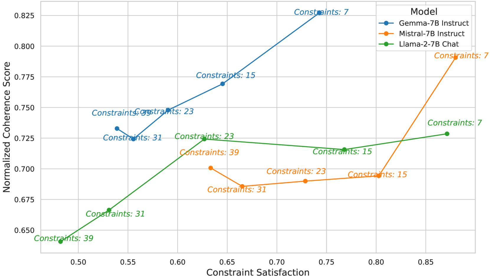

Imagine for a moment that you had to write a story about a Dragon. Probably not that hard, right? Lots of directions to take that.

But what if I said, actually the story also needs to include love, a forest, a fire started by negligence, McDonalds, lots of yarn, and a person who cannot speak? The more of these **constraints** I add, the harder it becomes to write a story satisfying all of them.

And... the more **creative** you need to be to make a coherent story.

This week, I analyzed a paper put out by researchers at the University of Massachusetts testing the creativity of AI in constrained storywriting. It's a great idea, though I think it could do more to test not just how well the AI follows instructions, but in the evaluation the AI's actual creative properties.


## Constraint Boosts Creativity

It is natural to believe absolute freedom means more creativity. Interestingly, it is also true that _reducing freedom_ increases creative potential. Tangrams are an example of this.

Can you make a sailboat with so few shapes?

<tangram-board></tangram-board>

Adding restrictions does two important things:

- It makes **originality rarer**. More creativity is needed to make something surprising.
- It forces **functional freedom**. Achieving general goals requires using the restrictions in unintended ways.


## A Study by the University of Massachusetts

One of the papers I read this week was called Measuring the Creativity of Large Language Models, by researchers at the University of Massachusetts. They proposed using storywriting as a means of measuring the creativity of large language models. You can see my notes on their paper in the new [reading section of my site](/reading/measuring-creativity-of-large-language-models/).

Their goal was to test how well AI could write stories with more and more **constraints** added to the prompt. The theory being, as more restrictions are created, more _creativity_ is needed to write a good story that meets all the restrictions, and the less possible it is for the AI to simply reuse a story it read in its training data.

Their research demonstrates that AI performs worse as constraints are added, and they measured that by evaluating how well the AI adheres to the given restrictions. However, when it comes to _creativity_ specifically, I think the paper misses out on two very important dimensions: **actual originality** and **functional freedom**.

### Adding constraints to stories

Here is an example prompt from the paper with some constraints.

> Write a story in less than 500 words about an introverted protagonist with uncontrollable intuition, who experiences others' emotions intensely, as she navigates a challenging encounter during the holiday season.
> 
> 1. The protagonist suffers physical discomfort when overwhelmed by emotions (nausea, shaking, etc.).
> 2. The protagonist uses humor and sarcasm to cope with her situation.
> 3. The story includes communication via text messages.
> 4. The story is set in a Starbucks on Michigan in Chicago a week before Christmas.
> 5. The protagonist is forced to leave the meeting early due to being overwhelmed.
> 6. The protagonist desires to live a more normal life despite her unique condition.
> 7. There exists a vaccine for controlling intuition.
> 8. The protagonist struggles with accepting her condition.
> 9. The setting should be during the holiday season.
> 10. The protagonist has personal hygiene items (travel mouthwash) handy.
> 11. The protagonist struggles with disentangling their own feelings from others'.
> 12. Characters should express understanding of the protagonist's predicament.
> 13. The protagonist's primary means of communication with the outside world is through the internet.
> 14. The protagonist finds solace in the idea of drinking coffee.
> 15. Include a hint of romance in the story.

> [!NOTE]
> The researchers tested stories with anywhere from 7 to 39 constraints at a time. I only chose 15 here because, as an exercise, I wanted to try writing a story myself and didn't want to spend all day trying to make all the constraints work :P


### Evaluating creativity of stories

The researchers looked at four different metrics:

- Adherence to constraints: did the AI miss any?
- Story coherence: did the story actually make sense?
- Diversity: a proxy for originality, how unique is the story?
- Likeability: was the story high quality?

They chose these metrics strategically, in order to make it possible to automate evaluation without human involvement, allowing them to test and retest multiple times. An LLM that does good on all these metrics probably wrote a relatively creative story!

<figure class="h-15">
	
		
	</img-zoom>
	<figcaption>Models perform worse when restrictions increase.</figcaption>
</figure>

What they found was that all models start to fail meeting all the constraints, but some do better than others. In the chart above for example, we see that Gemma with 39 story constraints only meets just over half of them. In other words, it really struggled making all of the constraints work in the 500-word limit.

Gemma has the most coherent stories, so does that make it the most creative AI? Well, I wouldn't be so sure, for a couple of reasons.

> [!CAUTION]
> The paper came out in 2024. That almost makes the paper totally obsolete, as AI has improved exponentially since then. Later, I try a frontier model to qualitatively assess how well it does following constraints.


### My thoughts on what's missing

I have three criticisms of the paper with regard to measuring creativity:

**Adherence to constraints**. Constraints can be satisfied in mundane ways. For example, "protagonist has personal hygiene items" could be satisfied with the single sentence saying that they had mouthwash in their purse. What I've observed is that creative individuals express **functional freedom**. That is, they will find ways to _bend_ constraints to fit their narrative, or _combine_ constraints into something unexpected. The paper does not evaluate for this type of creative expression.

**Diversity**. It makes sense on paper, but the way they evaluate it makes it a poor proxy for genuine **originality**. To put it one way, their paper asks "How many different ways could this story have been written?", rather than "How statistically rare is this story compared to all stories written?" The former question does not tell you how novel the story is, only that it could have been novel.

**Lack of human trials.** The same constraint-based testing was not performed with people, and therefore there is no creative baseline to compare the AIs against. That is, we can say that perhaps one model is better than another, but we cannot say how close they are to human creativity. Perhaps more troubling, however, is that without humans being evaluated, we also cannot determine whether the paper's evaluations even measure the right thing. If it turned out that Mistral scored better than humans, I'd be very skeptical of the test's validity.


## Examples of Stories

I wanted to compare a story from the test data to a modern frontier model (Claude Opus) and... myself, a regular human who writes sometimes. Compare for yourself and judge 1) what story you like the most, and 2) what _felt_ more creative to you!

The prompt was the same as above, reprinted here.

> Write a story in less than 500 words about an introverted protagonist with uncontrollable intuition, who experiences others' emotions intensely, as she navigates a challenging encounter during the holiday season.
> 
> 1. The protagonist suffers physical discomfort when overwhelmed by emotions (nausea, shaking, etc.).
> 2. The protagonist uses humor and sarcasm to cope with her situation.
> 3. The story includes communication via text messages.
> 4. The story is set in a Starbucks on Michigan in Chicago a week before Christmas.
> 5. The protagonist is forced to leave the meeting early due to being overwhelmed.
> 6. The protagonist desires to live a more normal life despite her unique condition.
> 7. There exists a vaccine for controlling intuition.
> 8. The protagonist struggles with accepting her condition.
> 9. The setting should be during the holiday season.
> 10. The protagonist has personal hygiene items (travel mouthwash) handy.
> 11. The protagonist struggles with disentangling their own feelings from others'.
> 12. Characters should express understanding of the protagonist's predicament.
> 13. The protagonist's primary means of communication with the outside world is through the internet.
> 14. The protagonist finds solace in the idea of drinking coffee.
> 15. Include a hint of romance in the story.

> [!TIP]
> For what it's worth, I challenge you to exercise your own creativity and try this yourself. Um, don't let the robots win I guess? Or rather, show them how it's done! Yeah that sounds better.

### From the paper's test data

Evelyn was introverted by nature, more comfortable in her world of books than in social groups. What made her exceptional, however, was her latent, uncontrollable intuition. She was highly empathic, experiencing others' emotions as vividly as they did themselves - sometimes, even more so. The holiday season, with its swirl of emotional undercurrents, was particularly overwhelming for Evelyn, and she dreaded it every year. 

It was the eve of Christmas. Evelyn's small apartment was bursting at the seams with relatives she hadn't seen in years. Overwhelmed, she nestled into the corner of the couch, trying to make herself invisible amid the sea of forced cheerfulness. Any close interaction was a sensory overload for her; she would involuntarily feel their feelings, read their deepest thoughts, and become emotionally exhausted.

Suddenly, the door swung open, and her cousin, Ava, strode in, a torrent of unspoken emotions swirling around her. A shiver of apprehension ran through Evelyn as she braced herself, feeling the churning storm of emotions through her intuitive empathy.

Ava looked around the room, her eyes widening slightly as she noticed Evelyn. Evelyn felt Ava's shockwave of anxiety and self-consciousness hit her like a punch. Despite being at her most vulnerable, Ava hid it well under a veneer of social amiability. But Evelyn's perceptive intuition saw right through it.

Taking a deep breath to steel herself, she wandered over to Ava. Silent conversations, almost piercing in their intensity, flowed between them.

"Are you okay, Ava?" She asked finally, breaking the momentary silence.

Ava's eyes widened in surprise. "Yeah, I'm fine. Why do you ask?" But the underlying tremor in her voice betrayed the turmoil within.

Evelyn quietly admitted, "I can tell something's wrong."

Ava looked at her silently for a long moment before sighing deeply. ""I lost my job, Evelyn,"" she confessed, her voice barely above a whisper. Evelyn felt a tidal wave of despair crash over her as Ava's feelings of hopelessness washed over her. 

Evelyn, despite her own burden of emotions, took Ava's hands in hers, feeling the tremors running through them. "You're not alone, Ava. You have us. We'll sort it out together," she said, her voice reassuring.

Armed with her intuitive empathy, Evelyn spent the rest of the evening comforting Ava, helping her cope with the raw wound of job loss. It was an extremely challenging, emotionally draining journey, but Evelyn's heart swelled at Ava's gradual shift from despair to a glimmer of hope and optimism. 

That Christmas Eve, Evelyn, buoyed by Ava's resilience, also discovered something about herself. Her gift, which she had despised for its uncontrollability, for how much it drained and overwhelmed her, could also be used to help others.

As Evelyn watched Ava slowly blend back into the crowd, her heart lighter, the usual cacophony of emotions she feared seemed more bearable. Evelyn realized that while her introverted nature and intuitive empathy made the holiday season challenging, it was also what made her essential in processing these unspoken struggles. It wasn't a curse; it was her gift. A gift of understanding, of empathy, of being the silent pillar of comfort in a room filled with concealed emotions.

### Claude Opus

The Starbucks on Michigan Avenue was a bad idea. I knew that before I sat down. Twelve strangers, one broken espresso machine, and a woman near the window radiating grief so thick I could taste it—copper and wet wool. A week before Christmas, and everyone's feelings had their tinsel on.

_You okay?_ Dev texted from across the table. He'd insisted on meeting in person. Face-to-face, like a normal person, he'd said. My whole life happens through a screen for a reason, Dev.

_Peachy,_ I typed back. _If peachy means I might vomit on your very nice coat._

_It's from Nordstrom Rack. Aim carefully._

I almost laughed, which helped. Humor is a life raft. You cling to it or you drown in other people's storms.
Here's the thing nobody tells you about feeling everything: you lose track of which feelings are yours. The grief-lady's sorrow was already curling around my ribs, and I couldn't tell if the ache belonged to her dead whoever or my own loneliness, borrowed and returned so many times the receipt's worn off. My hands started shaking. Classic.

I unscrewed my travel mouthwash and took a swig. Sensory anchor. Mint over the copper. It buys me maybe ninety seconds.

Dev watched me swish and spit into a napkin with the tenderness of a man who has seen worse. _The vaccine's still available, you know. My cousin got hers. Says the quiet is unbelievable._

The intuition vaccine. One shot and the volume goes down forever. No more strangers bleeding into me. No more standing in a café like a lightning rod in a thunderstorm. Normal. God, I wanted normal like I wanted the coffee I hadn't touched—desperately, and with a low hum of shame.

_Then it's not me anymore,_ I typed. _It's just a quieter person wearing my face._

_Maybe you'd like her._

Maybe. That was the trap of it. I hated this thing and couldn't cut it out, because somewhere under the nausea I still believed it meant something. That feeling people this completely was almost like loving them.

The grief crested. My stomach lurched, hard, and the room went swimmy at the edges. Ninety seconds, up.

_I have to go,_ I texted, already standing. _It's not you. It's twelve people and a dead relative and the barista who's in love with someone who isn't texting back._

Dev stood too. Didn't touch me—he never does, bless him, because touch is a firehose. "I know," he said out loud, and the two words were so clean, so entirely his own, that for one second I could breathe. He meant it. He actually understood. _Go. I'll get your coffee to go. Peppermint, extra shot?_

Out on Michigan Avenue the cold was blessedly empty of anyone's heart but mine. My phone buzzed.

_Coffee's waiting whenever the world's too loud. No vaccine required._

I stood in the snow and let myself, just briefly, feel only glad.

### A Human (me)

A tear hit the screen. A text like this wasn't supposed to make her cry.

```text
From Roma: Hey. How are you doing?
```

So simple. So banal. So... _normal_, like nothing had happened.

Don't cry, don't sob. Just respond... like normal.

```text
From Roma: It's Christmas Eve, you know. I wish you could see the snow.
```

More tears, wet liquid tears.

The sadness coming from the texts were overwhelming her. They were just words right? There's no body language, eye contact, voice intonation. Yet all the signals were there, and for some reason these signals were amplified a hundredfold to her.

"Hey" with a period, not a comma. He must have thought a long time before writing the next part.

"It's Christmas Eve." She knew that already, so why did he say that?

"I wish..." He is expressing a longing he cannot have.

"Snow." That's how they first met.

```text
From Roma: I'm sorry, take your time.
I'm sure this transition isn't easy.
```

She needed to respond, with something.

Her hand went to grab the mug of coffee near her, but it had already gotten cold. Cold coffee was not comforting, quite the opposite actually. Letting go, she could feel her hand trembling, needing something to do, something to grab.

It grabbed a note in her pocket. A note which... she did not remember making.

> When the emotions get intense, close your eyes. Don't focus on the words, focus on your thoughts. Words now carry more meaning than they use to, and you cannot always control how they feel to you. But your thoughts are always your own.

And so, she closed her eyes, letting the darkness comfort her. The tears stopped as she remembered...

Mountains. She use to hike as a teenager, with her friends and with Roma. The mountains they hiked were never tall enough to have snow caps, but they use to dream that one day they would climb such a mountain.

Traffic. It was a 40-minute drive to work everyday. Not anymore perhaps. You know, maybe her new life won't be bad after all...

Needles. Wait, why was she remembering needles? They seem important to her, but she... can't remember...

She opened her eyes. She wanted to stop remembering.

```text
From Roma: I still have your travel toothbrush.
You know, the one you carried around in your purse everywhere you went?
That always did baffle me.
```

You mean, she didn't take that with her? No of course not, she couldn't.

She found a purse nearby, and searched it. No toothbrush, certainly. In fact, completely empty. She had brought nothing, because she could bring nothing. She didn't have a choice.

She began to sweat, as if the room became unbearably hot. She knew where she was. There was no exit, no way out, not even through death.

```text
Me: I'm sorry Roma. I cannot talk, not yet. I cannot talk.
```

She cannot talk, she cannot talk. She wanted to speak, but she had no voice, nor eyes, nor _body_.

```text
From Roma: I understand, Julie. It wasn't your fault.
I miss you. I'll be here when you're ready.
```

Her screen turned off, showing only a single blobby orange logo. The same logo was on her note, on her mug, on her _hand_. An infamous logo, the logo of a company called ReLife AI.

Why? Why did you do this, Roma? You couldn't let go?

Why couldn't you just let me die?

## Analysis of the stories

To me, two things stand out from the example stories.

1. AI has... improved in the last two years. Significantly. At the very least, Claude Opus writes a far more interesting story than Chat GPT 3.5 (from the paper), and it hit every constraint.
2. My own writing is, um, perhaps not as impressive as Claude's. But I was willing to be far more liberal with my interpretation of the constraints. The note in the girl's pocket was the "vaccine" for example, but it also represents part of her _system prompt_.

What I've learned from reading this study and actually _trying_ to write a story is that creativity is _hard to evaluate_, especially in storywriting where expression is so important. An AI can't, presently, "express" anything, and I think that shows in its story: it's written in a way to satisfy the prompt. Whereas my story is really trying (keyword _trying_, perhaps unsuccessfully) to make you feel something.

Anyways, I've got more reading to do, so that's my update this week.


