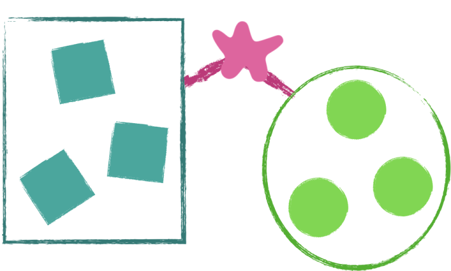

> [!NOTE]
> **By the way**: This article is an adaptation from a presentation I did as a software engineering coach.

"How can I become more creative?"

Unsurprisingly, this is not a simple question to answer! It all hinges on that word "creative". After all, what "creative" means should substantially influence what it takes to get more of it, right?

Upon seeing the word, a flurry of images and ideas probably come to mind. When we think of "creativity", we also tend to think of art, music, writing, activities lacking a _formula_ so to speak. Maybe the image of a light bulb comes to mind, symbolizing a winning idea no one as thought of before. And yet, trying to pinpoint a concise, solid definition is itself elusive.

That is, it requires creativity to define creativity.

Ok, so let's put that aside for a moment and revisit the original question: "How can I become more creative?" I propose we try a little experiment! Let's see if we can come up with a creative solution to an otherwise mundane problem...

## The Problem

When I originally gave this presentation, I was a software engineering trainer to college graduates and career changers. As trainers, one of our duties was to provide sessions on various things ranging from good coding practices to agile processes. Promptness to sessions was a consistent issue, and perhaps unfortunately the sessions were somewhat densely designed, so even a few minutes meant a lot.

And so, the problem statement: **How can we ensure people are on time to sessions?**

> [!WARNING]
> To be fair, I personally didn't mind being a minute or two late. After all, I could probably count on two hands the number of times real meetings with clients actually started on time!

## Initial Ideas

Alright, so with a problem statement in hand, we can begin brainstorming some solutions! Our goal is for our solution to be practical and low effort, yet effective at starting sessions on time. Given that, we can come up with some ideas...

1. At the end of each session, remind trainees to be on time for the next session.
2. Close the door and start on time anyways.
3. Give individual feedback to those who arrive late.
4. ...?

At some point we hit a wall. After all, it's up to the trainees whether they value being on time; trainers do not have that many levers to pull. How can we be more creative with a problem like this?

## All Ideas

Well, we said that our soluton had to be "practical" and "effective". What if we discard those restrictions entirely? Let's brainstorm more ideas, but this time put _every single idea_ on the board, no matter how silly or impossible it may be!

4. Make the session actually start one minute later.
5. Give everyone food if they are on time.
6. Change the way time is measured.
7. Turn on the water sprinklers in the hallway once it is time to start.
8. Make people magically appear in the room when the session starts.

Ok, _hold up a sec_. How can this possibly be useful? Teleportation is a physical impossibility, so wouldn't such a idea be thrown out in the end anyway?

Perhaps. But there's a reason we want _every_ idea visible on the board. We're not going to stop at just 8 ideas; let's keep going!

## Combining Ideas

You know, looking at ideas 4 and 6 gives me another idea...

<small>

4. Make the session actually start **one minute later**.
5. Give everyone food if they are on time.
6. Change the **way time is measured**.
7. Turn on the water sprinklers in the hallway once it is time to start.
8. Make people magically appear in the room when the session starts.

</small>

9. **Make clocks outside the room one minute fast.**

Interesting! The word "food" in idea 5 gives me another idea too...

10. **Move the snacks into the session rooms.**

And that word "magically" in idea 8, what if...

11. **Do a magic trick at the start of the session.**

That last idea is especially fascinating. Not only is it possible to actually do, it might even incentivize people to come early to see an interesting trick, and for those who are slightly late, it's fine! All they'd be missing is a card trick.

Moreover, the idea is a bit out of the ordinary, rather unlike the first three original solutions. One may even say it's a bit _"creative"_!

> [!IMPORTANT]
> I had actually started this session with a simple card trick, which made the reveal of point 11 somewhat comical.

## Deferring Judgement

In order to get to the more creative ideas, we had to **defer our judgement**. That is, rather than evaluate each solution as they came to us, we chose to _keep every idea_, even if it appeared silly at first.

As it turns out, problem solving actually has two distinct phases: **ideation** and **evaluation**.

* Ideation is a _divergent_ thinking exercise, meaning the goal is to generate as many solutions as possible, knowing that at least some of those solutions will be creative yet effective.
* Evaluation is a _convergent_ thinking exercise, meaning the goal is to identify which of the many ideas is the most viable and interesting.

A common trap is to do both ideation and evaluation simultaneously, judging ideas as they come up without giving them a chance. In my experience, this is one of the biggest hindrances to creative thinking, which is why it's so powerful to recognize the phases and create a definite divide between them!

Deferring judgement enhances creativity.

	<figure>
		
			
		</img-zoom>
		<figcaption>A common antipattern is to ideate and evaluate at the same time.</figcaption>
	</figure>
	<figure>
		
			
		</img-zoom>
		<figcaption>Ideation and evaluation should be distinct exercises!</figcaption>
	</figure>

## Creating Provocations

Deferring judgement enhances creativity by allowing the creation of **provocations**. A provocation is a deliberate departure from normal problem solving with the intent of shifting our thinking into a new space of ideas.

That's a fancy way of saying that provocations are crazy, perhaps untenable, ideas, but which cause us to think about the problem a different way.

Thinking back to the original problem of encouraging people to attend sessions on time, we first created the provocation of making people magically appear in the session room on time. Clearly, that's impossible. However, the word "magic" opened up a different possibility, allowing us to see the idea of initiating sessions with a magic trick.\

And that's why it was so important to write down the provocation anyway! We want to give ourselves as much time to create links between different _types_ of solutions, and create more opportunities to discover something creative.

<major-point>
	By judging ideas <strong>later</strong>, we give our <strong>crazy</strong> ideas time to become <strong>plausible</strong>.
</major-point>

I like to imagine provocations as bridges, taking us from one island of solutions to another.

<figure class="h-15">
	
		
	</img-zoom>
	<figcaption>Provocations build a bridge from one idea space to another.</figcaption>
</figure>

> [!NOTE]
> Creating provocations is a lateral thinking technique coined by psychologist Edward de Bono.

## Building Bridges

So, "How can I become more creative?"

There are lots of ways to answer that, but my first answer will usually be to **defer judgement**: separate the exercises of ideation and evaluation and give yourself the time and space to create unique and far-reaching ideas. Although our example was for solving a mundane problem, this simple principle can apply to the arts as well. Making connections between otherwise disparate things means letting the connection become a possibility.

In the end, creativity is all about building bridges.
