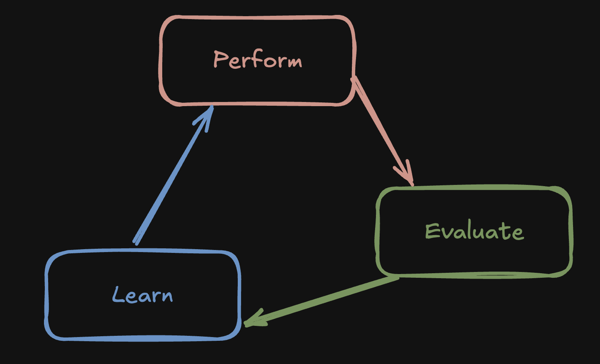
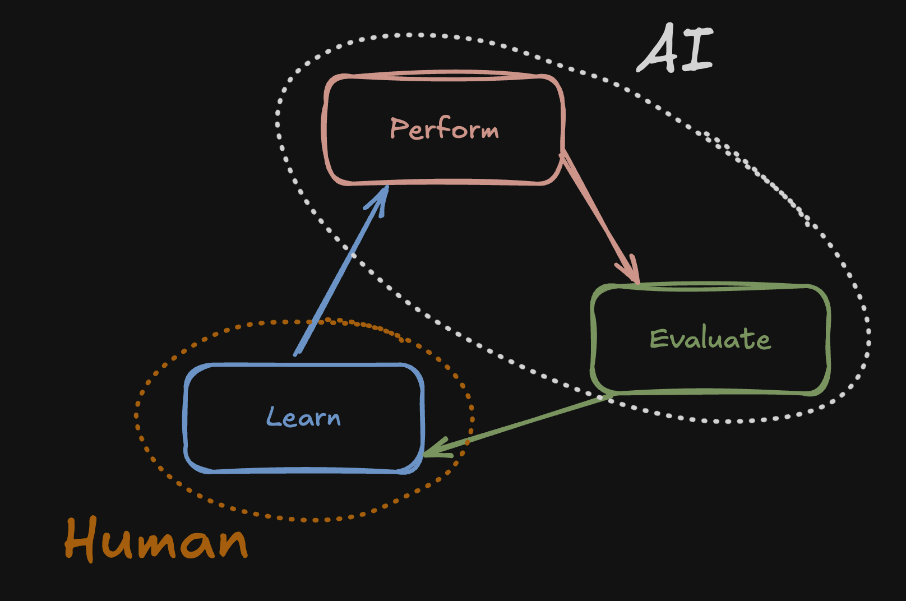

There's an old saying for people who want to learn new skills:

<major-point>

Practice makes perfect.

</major-point>

But what if you're an AI that wants to learn new skills? AI "learns" by eating oceans of data until it spits out stuff that looks like the data. That's more like... reading, not "practicing". AI systems like Claude Code cannot practice new skills like we can.

Or can they?


## What is "practice"?

Practice is doing something over and over again until you get better at the thing you are practicing. But like, how does that actually work?

Practice is a **loop**:

<figure class="h-15">
	
		
	</img-zoom>
	<figcaption>Practice has three components.</figcaption>
</figure>

1. You **perform**, doing the thing you want to get better at, without judging your own performance.
2. You **evaluate**, determining what went well and where you can improve, ideally with feedback from others.
3. You **learn**, taking what could be improved and identifying ways those things can actually improve.

Perhaps you don't consciously follow this exactly process; maybe you just play music a lot and find yourself getting better over the years. That's kind of the beauty of the brain. Conscious or not, its identifying things that could be better, making adjustments, and if the adjustments improved the result, it "keeps" the adjustments.

Contrast this to an AI "brain" which, for the most part, cannot physically change after it's been trained. Despite that, AI can still learn "skills" in a manner of speaking.


## AI "skills"

Think of something you're really good at, and consider the exercise of writing down on a piece of paper all the things that make you good, filling the paper with as much detail as possible until it is saturated with scribbles.

> [!TIP]
> For what it's worth, I _actually_ recommend trying this. Seeing the depth of your skill is a good way to boost your confidence.

In a way, that's what a "skill" is to artificial intelligence. It is literally a document telling it how to do something well.

For example, here is a skill I wrote telling Claude how to log into a website:

```markdown
---
name: login-to-localhost
description: Use when navigating the website via agent-browser and needing to log in as a test user.
---

You should pretend to be a real user when using the website via agent-browser. Do not try and get a token from pocketbase manually, do everything within the website.

When you want to login, follow these steps:

1. Click the login button on the website.
2. Use `claude@disneybounding.com` as your email.
3. In a separate browser session, navigate to `localhost:8025`. This is Mailpit. It will have an email with the auth code in it. Find that email and remember the six-digit code.
4. Go back to the website, input the OTP code, and log in.
```

AI skills don't get baked into their brains. To something like Claude, skills are a library of manuals it uses to constantly remind itself how to do stuff. Which is... _very alien_ compared to how we humans learn, and yet... it _works_ as a form of learning for large language models.

## Evaluating skills

Software developers test their code. Hopefully. I mean, it would be bad to make a payment portal and not even test it, and OOPS people get triple charged because of some jank requeueing process.

Nowadays developers are writing _skills_ for AI agents to make them better at coding, debugging, and many more things.

> [!NOTE]
> As for me, I want to help AI be more creative, so I've been contemplating a skill to teach it how.

**Skills are software**, and **software should be tested**. With that in mind, I tried my hand at creating an evaluation framework of sorts, some way to test whether or not the AI running a skill actually does what I want. I mean, if I wrote a skill to organize notes into folders and instead it puts all the papers into a single folder, that would be wrong.

### My attempt

I **[wrote some code](https://github.com/Auroratide/ai-skills-and-evaluation)** that allows me to evaluate the effectiveness of skills. My goals were to achieve:

- **Repeatability**: I need to run the skill many many times, making tweaks until I get the result I want.
- **Isolation**: I want the AI to run in a sandbox so it can't affect any real files on my system. It's just safer that way.
- **Invokability**: I want the AI to know _when_ to use a skill, and when not to.

To achieve repeatability, each "test" for a skill is a template, a prompt, and a rubric. The prompt tells the AI what to do, and the rubric is used later to grade how well it did. The template is the repeatable part: it is the _starting state_ for the AI, which it presumably modifies in the process of executing its skill. Think of the template as the "before" in "before and after". Each time the test is run, the state is reverted to the template so the AI can start over.

To achieve isolation, I use docker containers. You don't need to know much about docker, just know that it's kinda like giving the AI its own computer-in-a-computer so it gets its own personal playground.

To achieve invokability, I don't tell the AI in the prompt to execute the skill. I give it instructions that imply it should use the skill, and then check later whether it actually did. This is important, because knowing _when_ to deploy a skill is just as important as knowing _how_ to do it.

### A video demo

The video below shows me testing whether I've successfully taught Claude how to write accessible HTML for modal popups.

<figure>
  <video controls>
    <source src="./claude-invocation.mp4" type="video/mp4" />
  </video>
  <figcaption>I invoke the test, which executes the skill and then grades it.</figcaption>
</figure>

> [!CAUTION]
> The execution of the skill was not actually that fast! The whole thing took about 2 minutes, I cut out the waiting.

### Things to improve

While cool, there are a _lot_ of things that need to improve about my current approach. The most important ones:

- Tests take a really long time to run, and burn a ton of tokens.
- Tests are flakey, meaning sometimes they fail and sometimes they pass. This is because AI is non-determinstic, so sometimes it just does the wrong thing, or even ignores the skill altogether.
- The rubric relies on an AI model using it accurately, which means the classic question, "what if the grader is wrong?" Really, there should be a hybrid test, where the rubric checks fuzzy criteria, and _code_ checks hard requirements.


## Can AI practice?

Notably, if practice is a loop between performing, evaluating, and learning, then what I've just attempted was the automation of the "evaluation" phase. Basically:

<figure class="h-15">
	
		
	</img-zoom>
	<figcaption>AI covers perform and evaluate, while the human helps it learn.</figcaption>
</figure>

That is, in my model, the AI is now able to both run the skill and evaluate itself. However, I the human am still authoring the skill itself, as well as the rubric. That is, I'm still identifying what went wrong and making judgments on how to best fix it.

This image concretely shows, however, what is necessary to get the AI into its own self-sustaining practice loop: if I wire the AI to modify its own skills based on the results of a run, then it effectively recursively improves itself.


## Wait, is this "recursive self improvement"?

Let's not get ahead of ourselves.

Like, if you're wondering whether AI can teach itself anything, the answer is effectively yes. It's not how humans learn, in that we don't write successively better manuals to ourselves. Yet to an AI, this _is_ what learning looks like.

But is this the kind of hyperpowered RSI that accels promise will take us to the stars next year?

No, for three reasons:

- This loop helps AI learn simple skills, but skills like "make yourself more generally intelligent" are really complicated and probably cannot be distilled to a simple word document.
- I suspect that for AI to _actually_ get smarter, it will require the ability to change its own parameters, which for now it cannot do fully autonomously.
- I haven't tried closing the loop yet, but I suspect that without a human in the loop, all closing the loop will do is amplify the AI's hallucinations.

So yes, AI can practice. But no, that doesn't make it human-general.

## What next?

I went down this rabbit hole because I wanted a way to iteratively run AI skills that test for creativity. So I suppose it's time I actually _try_ to write a creativity skill and see if it does any good.

