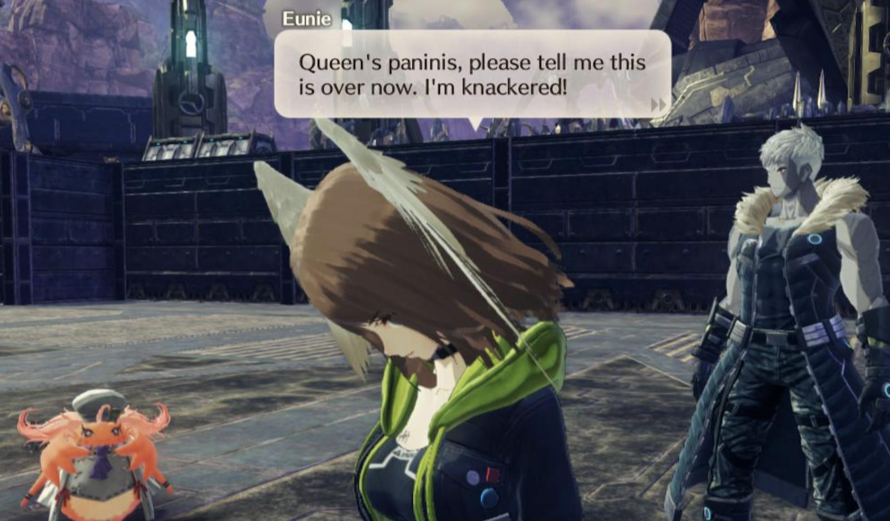

<style>
	@media screen and (max-width: 75rem) {
		.mobile\:hide-middle th:nth-child(2),
		.mobile\:hide-middle td:nth-child(2) {
			display: none;
		}
	}

	.middle-smaller td:nth-child(2) {
		font-size: 80%;
		padding-block-start: 0.65em;
	}
</style>

Stub your toe, and you'll probably say, "OW!", or "FRICK!", or "████!" (<small>my parents would get mad if I wrote it out</small>)

But in the fictional nation of Keves, they might say **"Queen's spleen!"**, or **"Queen's royal robes!"**

Keves is a country in the game [Xenoblade Chronicles 3](https://xenoblade.fandom.com/wiki/Xenoblade_Chronicles_3). As you might have guessed, they have a queen, but they use her name in the strangest sort of expletives.

I mean, it starts innocently enough. 

* "<mark>Queen's Oath</mark>, this pisses me off."
* "Will you quit shouting at everything for <mark>Queen's sake</mark>?!"

But then it gets... hilarious.

* "<mark>Queen's cuticles</mark>, I'm gonna hate this..."
* "<mark>Queen's fluffy tufts</mark>, so you've heard of me!"
* "<mark>Queen's paninis</mark>, please tell me this is over now."

Yep. Queen's paninis.

And honestly, I love it. Like, how deep does this rabbit hole go? What could possibly be more exotic than "Queen's paninis"??

<figure class="h-15">
	
		
	</img-zoom>
	<figcaption>This is really in the game</figcaption>
</figure>

## Every Single "Queen's _____"

These are not in chronological order, nor am I citing who or when these were said to avoid game spoilers. But I did rate them, I mean why in queen's nose hairs would I not?

<div class="mobile:hide-middle middle-smaller">

| Expletive | Quote | Rating |
| --------- | ----- | ------ |
| Queen's baubles | Queen's baubles, so our mystery guy was here all along!!! | **3/5** |
| Queen's beans | Queen's beans! There's not even a nick in it!<br />Queen's beans, it's that bad? | **4/5**, it rhymes |
| Queen's calves | ...Queen's calves, this guy is a mystery to me. | **4/5**, better than thighs I guess? |
| Queen's crackers | Queen's crackers, lady, don't move it without telling us! | **3/5** |
| Queen's crispy fillets | Queen's crispy fillets! | **5/5**, so Keves has fried chicken! |
| Queen's cuticles | Queen's cuticles, I'm gonna hate this... | **5/5**, _so specific_ |
| Queen's dimples | What in the Queen's dimples did you do to her? | **3/5** |
| Queen's fingers | Queen's fingers, that was close! | **2/5** |
| Queen's fluffy tufts | Queen's fluffy tufts, so you've heard of me! | **4/5**, I'd never think to say this |
| Queen's knuckles | If you've got something to say, then do, or by the Queen's knuckles, I'll slap you. | **2/5** |
| Queen's knees | Huh, nothing? Queen's knees, what a waste of time... | **2/5**, not as good as calves |
| Queen's laces | Queen's laces, you lot... Let a girl have her hobbies, will ya? | **3/5** |
| Queen's name | "Undying"? What in the Queen's name? | **1/5**, too normie |
| Queen's oath | Queen's Oath, this pisses me off.<br />Queen's oath... | **1/5** |
| Queen's paninis | Queen's paninis, please tell me this is over now. I'm knackered! | **5/5**, perfect |
| Queen's primary feathers | Oh, Queen's primary feathers! You're still alive! | **4/5**, six syllables?! |
| Queen's royal robes | Where in the Queen's royal robes could she be? | **3/5** |
| Queen's ruffles | Queen's ruffles...! | **3/5** |
| Queen's sake | And what were those soldiers, for Queen's sake? I thought I was goin' crazy!<br />Don't just lie about it then! Queen's sake!<br />Will you quit shouting at everything for Queen's sake?!<br />(sigh) Queen's sake... | **1/5** |
| Queen's spleen | Queen's spleen, I hate that maniac... | **5/5**, an internal organ?? |
| Queen's teeth | Queen's teeth, no wonder they wanna kill you! | **3/5** |
| Queen's wings | Queen's wings, have you lost the snuffin' plot?!<br />Queen's wings, what is in this pot?<br />Queen's flapping wings...<br />Queen's flapping wings... She's completely off the rails...<br />Ugh, I knew it... Queen's wings, just let us go! | **2/5**, eh, it's her most prominent feature |
| Queen's word | Queen's word, we're looking into this ether cylinder fiasco with the utmost seriousness. | **1/5** |

</div>

## How I Found These

I found the entire [script of Xenoblade 3](https://drive.google.com/drive/folders/1xGGpg6lcakmiY7dD7ntE-OJgTUePh9BF) online, downloaded it, and ran a simple shell script over the whole thing:

```shell
grep -rEi "Queen's [^[:space:]]+" Dialogue --include \*.json
```

Here's a breakdown of the code for the curious!

* `grep`: Grep is a command for finding text in files.
* `-rEi`: `r` means search all folders and subfolders, and `i` means ignore letter casing. The `E` says to search for a _pattern_ rather than exact text.
* `"[^[:space:]]+`: Find any word that doesn't have a space in it.
* `--include \*.json`: The scripts were in `json` files, so this says to look at those files.

Finally, I just manually combed though the list and removed anything that wasn't an expletive, for instance "The Queen's Anniversary's gonna start without us, guys!". Had the list been too long, I might have turned to AI to pare the list down for me.