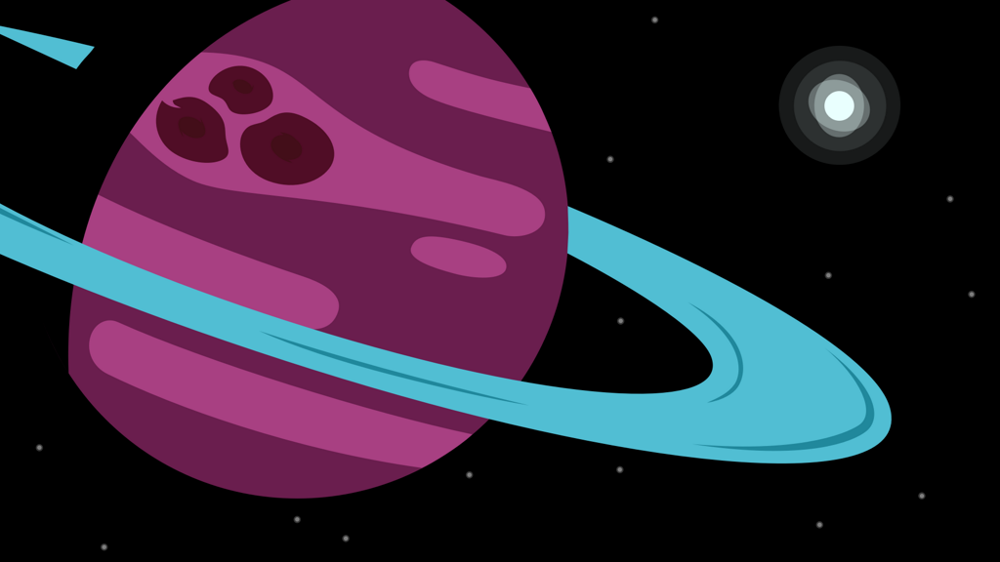

For years, I had been writing the wrong alt text for my images.

<abbr title="Hypertext Markup Language">HTML</abbr>, the language in which websites are written, allows developers to define **alt text** for images. It's short for "alternate", letting creators specify a <q cite="https://developer.mozilla.org/en-US/docs/Web/HTML/Element/Img">text description of the image</q> just in case the image doesn't load or can't be seen. 

Here's a pretty example:

<figure class="h-15">
	
		
	</img-zoom>
</figure>

What alt text should be used for this?

I use to think something like "Alien World", or perhaps "A purple planet in space" were good; after all, they describe what the image is. However, after doing a deep dive into **accessibility** practices, I've come to learn that descriptions like these are not incredibly useful.

So, what _does_ make for good and useful alternative text? There's a number of tips and antipatterns I've discovered perusing the web, but actually I've found that a single, concise principle encompasses them all:

<major-point>
	Alt text is a <em>replacement</em>, not a description.
</major-point>

Let's see how this alternative paradigm helps write alt text for images!

## Replacing "Description"

Let's give the purple planet picture from above some story. We'll say it's a fictional planet called **Purpiter**, and Jenna is an extraterrestrial journalist writing about it. Probably she will want to include the image of Purpiter in the article so her readers know what the planet looks like.

Here's an excerpt from her article:

<blockquote>
	
Purpiter is a gas giant planet in orbit around the star Rigel Ba. Although beautiful at first glance, its iodine atmosphere would be toxic to our biology!

	<figure class="h-10">
		
	</figure>
	
Tourism to Purpiter is expected to take off within the next decade.

</blockquote>

Happy with the article, Jenna decides to publish it to an online interplanetary tourism guide. But when submitting the article, something goes wrong! Somehow, the image of Purpiter is corrupted while uploading, meaning it will not show up in the article. Oof.

Instead, the **alt text** will appear. Let's say she used the alt text from the intro, "Alien World". Here's how the article would appear:

> Purpiter is a gas giant planet in orbit around the star Rigel Ba. Although beautiful at first glance, its iodine atmosphere would be toxic to our biology!
> 
> **Alien World**
> 
> Tourism to Purpiter is expected to take off within the next decade.

That's not very useful, especially for a website about space tourism!

Although the phrase "Alien World" in some sense _describes_ Purpiter, it does not adequately _replace_ the image in the article. Even "a purple planet in space", though more descriptive, does not get everything across Jenna wanted by using an image.

She wants the alt text to serve as a **replacement**, so she needs to use it to convey the details of Purpiter that make it distinct and interesting.

> Purpiter is a gas giant planet in orbit around the star Rigel Ba. Although beautiful at first glance, its iodine atmosphere would be toxic to our biology!
> 
> **Purple clouds swirl about a planet, twisting into three red storms. Its icy ring reflects light from a star in the distance.**
> 
> Tourism to Purpiter is expected to take off within the next decade.

Much better! In the absence of the image, the alt text leaves us with a decent mental illustration of what should have been there.

> [!NOTE]
> Iodine is actually safe for humans. Perhaps it's toxic to Jenna's species though!

### Why does this matter?

So, maybe it's rather rare for images to just be missing. That said, image alt text serves two very important audiences.

Earlier, I had mentioned **accessibility**. Websites are used by both people who can see and people who cannot; as developers, our goal is to make websites _accessible_ to all groups of people, regardless of ability.

* How would someone with vision impairment "see" a picture? **Screen readers** are assistive tools that can read the contents of a web page out loud; when it encounters an image, it will read that image's alt text.
* Additionally, for users with **low internet bandwidth**, a large image might take some time to download. As a result, the alt text may be shown in the meantime.

In all cases, the hope is that the alt text is able to convey as much of the original image as needed. This is why I've started to think of it as a _replacement_, as its purpose is literally to replace the image under some circumstances.

> [!TIP]
> I highly recommend experimenting with screen readers if you work in the web!

### The Secret Technique

Imagine for a moment that you are talking with a friend over the phone <small>(I _think_ people still do that)</small>, and you are very excited about visiting Purpiter. You want them to come with you, so you recite Jenna's tourism article.

When you reach the image, **how would you describe it over the phone**?

<icon-divider icon="phone" aria-hidden="true"></icon-divider>

This thought experiment happens to be an incredibly useful technique for writing alt text. In a way, it's simulating what a screen reader would say.

## Intent is Important

Since alt text is a replacement, it's possible for the same image to have different text depending on the context. Let's consider two more articles for Purpiter to appear in:

1. A critique of the artistic style of the image
2. A wiki entry talking about exoplanets in general

### An Alternative Purpose for the Image

In an article about the artist's depiction of the planet, the focus is not necessarily on the fact that the planet is purple or has a blue ring. Hence, whilst the alt text from before is very descriptive, it wouldn't be a suitable _replacement_.

The intent is different. It's probably more important to highlight how the picture was drawn so the reader understands what is actually being criticized.

<icon-divider icon="paint-brush"></icon-divider>

Here's an example excerpt with the alt text in bold:

> Perot is an astrobiologist, but also a hobbyist artist. A sample of his artwork depicting the planet Purpiter is shown below.
> 
> **The planet is a purple circle with wide, rounded magenta strokes. Shapes transition sharply from one to the next, with no gradients between nor within features.**
> 
> Because of the simplicity of the coloring, he fails to convey the swirling nature of the storms.

### Decorative Images

Sometimes, images serve entirely as visual enhancement. That is, they provide a break from the wordiness of a lengthy article but do not actually contribute to the article's content.

In this case, the image could be replaced with nothing without impacting the core information. And so, the right alt text to use is just an **empty string**, signaling the image is decorative.

In an article about exoplanets in general, the image of Purpiter might just be decorative, showing an example of what an exoplanet _might_ look like. In the excerpt below, the image is provided but has empty alt text. See what happens when you use a screen reader!

<blockquote>
	
Exoplanets are planets outside of the solar system. We know they exist because of subtle clues provided by the light of their host stars.

	<figure class="h-10">
		
	</figure>
	
Over time, we've learned that exoplanets are incredibly diverse in size, composition, and countless other ways.

</blockquote>

> [!CAUTION]
> Empty alt text is different from **no** alt text! You should always define alt text, even if it is empty.

## All as the Spec Intended

So it turns out, I learned most of this by reading the [HTML Living Standard](https://html.spec.whatwg.org/multipage/images.html#alt), a specification provided by <abbr title="Web Hypertext Application Technology Working Group">WHATWG</abbr>.

The **specification** is essentially the HTML guidebook, which effectively means it's also the web developer guidebook. Despite that, I hadn't actually taken time to read it until recently in my career. Besides the notion that the word "specification" is scary, the document is also understandably technical and dense.

_Or so I thought_. In fact, the spec is written to be very readable and thorough! It details the semantic intent of HTML tags and attributes with scenarios and examples, in similar fashion to how I'd expect an article _summarizing_ the spec to be written.

<icon-divider icon="html5"></icon-divider>

The principle of "alt text is a _replacement_, not a description" is almost a direct quote from the spec:

<blockquote cite="https://html.spec.whatwg.org/multipage/images.html">
	
The intent is that <strong>replacing</strong> every image with the text of its <code>alt</code> attribute does not change the meaning of the page.

</blockquote>

And in fact, the "secret technique" of using a phone call as a thought experiment is not so secret after all. This, too, came directly from the spec!

<blockquote cite="https://html.spec.whatwg.org/multipage/images.html">
	
One way to think of alternative text is to think about how you would read the page containing the image to someone over the phone, without mentioning that there is an image present.

</blockquote>

So this idea of treating alt text as a replacement is not a new way of thinking about it. It's the perspective the HTML standard wanted us to have all along.

> [!WARNING]
> Admittedly, the spec is a bit advanced for beginners! My intent is to dispel the myth that the spec is reserved for experts. In WHATWG's own words, having a <q cite="https://html.spec.whatwg.org/multipage/introduction.html">passing familiarity with web technologies</q> can be enough.

## Where to go from here?

<major-point>
	Alt text is a replacement, not a description.
</major-point>

Although I covered what that means at a high level, there are more detailed questions we could ask about how it applies:

* What if the image is a button?
* What if I talk about the image in the content already?
* What if the image is of text?
* What if the image is too detailed to explain concisely?

This and more is covered directly by the HTML specification! It devotes no less than 15 subsections to image alt text, and while that may be intimidating, it also goes to show how important writing the right text is.

My recommendation for learning more is to read the **[HTML Spec on Image Alt Text](https://html.spec.whatwg.org/multipage/images.html#alt)**. For supplementary material, [MDN's article on alt](https://developer.mozilla.org/en-US/docs/Web/API/HTMLImageElement/alt) is pretty good as well.

## Addendum: On Length

I had received feedback that my original alt text examples were a bit lengthy. Indeed, it is important that the text be very concise! A picture may be worth 1000 words, but don't _actually_ use 1000 words to describe your picture.

Tools exist for when a lengthier description is needed, such as the [figure HTML element](https://developer.mozilla.org/en-US/docs/Web/HTML/Element/figure) and [aria-labelledby property](https://developer.mozilla.org/en-US/docs/Web/Accessibility/ARIA/ARIA_Techniques/Using_the_aria-labelledby_attribute). Notably, both of these expose the description to _everyone_, hinting that if your description is long enough to merit these tools, then it's probably important context for all readers, sighted and non-sighted.

Here's a before-and-after of my example alt text to illustrate brevity without losing meaning:

<dl>
  <dt>Before:</dt>
  <dd>Purple and pink clouds swirl about the planet, twisting into a knot of three deep red storms. An icy blue ring encircles the planet reflecting light from a bright star in the distance.</dd>
  <dt>After:</dt>
  <dd>Purple clouds swirl about a planet, twisting into three red storms. Its icy ring reflects light from a star in the distance.</dd>
</dl>

[WebAIM's article on alternative text](https://webaim.org/techniques/alttext/) goes into multiple examples on writing concise descriptions. Well worth a read!
