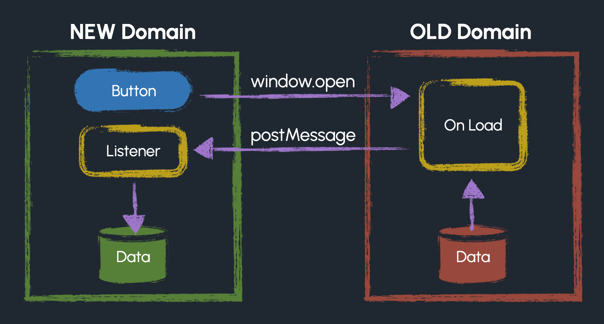
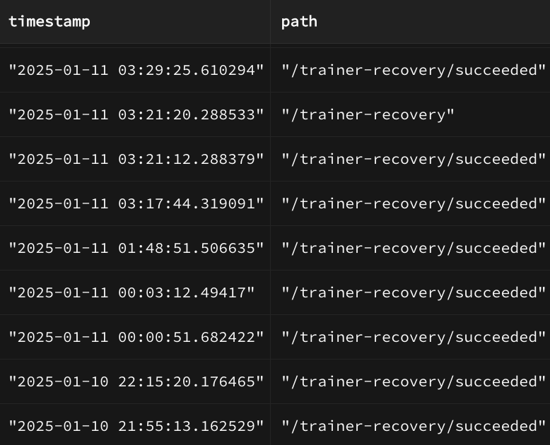
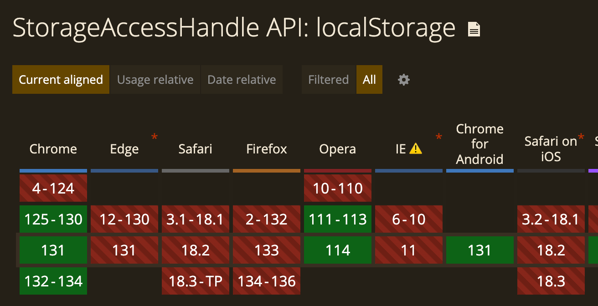

So you created a cool website hosted on Github Pages, and it somehow got popular. You decide, hey, let's buy a custom domain so instead of `myuser.github.io/cool-website`, it lives at `coolwebsite.com`!

**<span style="font-size: 1.25em; color: var(--t-red-b);">Not so fast!</span>**

If your site saves user data to [Browser Storage](https://developer.mozilla.org/en-US/docs/Web/API/Web_Storage_API), such as Local Storage or Indexed DB, then suddenly changing the domain will cause your users to lose their data.

I personally had to go through this process, and because I couldn't find any single "here's how to do it" articles, I'm writing one myself, just for you!

> [!CAUTION]
> **Backward compatibility** is important to consider with _any_ code change! For example, you can't just remove a column in a database without it probably breaking anything that depended on that column.

## The Strategy: Popup and postMessage

Here's the strat:

1. On the new site, show the user a message saying the website has a new domain, and data needs to be transfered.
2. In that message, show a button that says it clicking it will transfer the user's data to the new site.
3. When the button is clicked, open a popup window to the _old site_.
4. The old site gets its data in local storage, then uses `postMessage` to send it to the new site. It also closes itself.
5. The new site receives the message, and stores the data into its own local storage!

<figure class="h-15">
	
		
	</img-zoom>
	<figcaption>After the initial button press, everything is automatic.</figcaption>
</figure>

> [!WARNING]
> It's gross the user has to click a button at all, but it's necessary.
> 
> Browsers are like new parents, putting up barriers everywhere to keep your data safe. **Different websites cannot talk to each other**, and they definitely cannot share data. That simple rule stops bad websites from stealing your data from, for example, bank websites. This is called the **[Same-Origin Policy](https://developer.mozilla.org/en-US/docs/Web/Security/Same-origin_policy)**.
> 
> The exception to the rule is if the two websites agree to share messages by knowing each other's origins, and if the user gives explicit permission via an _interaction_. The requirement for an interaction is why a button press is required in our strategy.

### 1) Create the Popup Site

The goal of the popup window is to send data from the old domain to the new domain. It will do this by calling [postMessage](https://developer.mozilla.org/en-US/docs/Web/API/Window/postMessage), a function that enables different domains to talk to each other, from the old domain.

Create _another_ Github Pages website, which doesn't have a custom domain. Let's call it `storage-migration`, so that it lives at `https://username.github.io/storage-migration`. We're taking advantage of the fact that github pages websites share the same domain, namely `username.github.io`, if they don't specify a custom domain. Same origin, same storage!

> [!TIP]
> If you are not using Github Pages, in general you just need to ensure is that the original domain has some page that does _not_ redirect to the new site, so its popup code executes.

Create a page called `cool-website/popup.html`, and have it run this code when the page is opened:

```javascript
/// https://username.github.io/storage-migration/cool-website/popup

function send(message) {
	// Specify the origin; don't accidentally send your data anywhere else
	opener.postMessage(message, "https://coolwebsite.com")
}

function automaticallyTransfer() {
	try {
		// You may optionally filter for specific items in storage,
		// since all sites at auroratide.github.io share the same storage
		send(Object.entries(localStorage))
	} catch (e) {
		send("failed")
	} finally {
		// Always close the popup window, even if it failed
		window.close()
	}
}

if (opener != null) {
	automaticallyTransfer()
}
```

When this popup window opens, it will attempt to send everything in `localStorage` to the new domain, or if that fails for whatever reason, it'll send the string `"failed"`. Note that it is important anytime you use `postMessage` to include the intended recipient domain, to prevent other websites from opening your popup and stealing your users' data!

### 2) Respond to the message

The other half of the `postMessage` function is the ["message" event](https://developer.mozilla.org/en-US/docs/Web/API/Window/message_event). The "message" event carries the data that was sent with `postMessage`, along with the domain of the sender.

Before opening the popup window from our new domain, we should start listening for this event. Put this code on the site using your **new custom domain**:

```javascript
/// https://coolwebsite.com

function respondToMessage(event) {
	// Protect yourself: don't respond to messages from anywhere else
	if (event.origin !== "https://username.github.io") return

	// If not an array of entries, the popup must have failed
	if (!Array.isArray(event.data)) {
		setMigrationStatus(event.data)

	// Otherwise, move things into localStorage on the new site!
	} else {
		event.data.forEach(([key, value]) => {
			localStorage.setItem(key, value)
		})

		setMigrationStatus("done")
	}
}

// Listen for the message, before opening the popup
// Only if not started, though. getMigrationStatus() is defined later.
if (getMigrationStatus() === "not started") {
	window.addEventListener("message", respondToMessage)
}
```

### 3) Open the popup

Your new domain must open a popup window to the original domain. We'll do this by attaching a handler to a button that the user clicks to start the transfer.

> [!IMPORTANT]
> Do not try and open the popup automatically or use an iframe! Popups get auto-blocked unless initiated by an explicit user interaction, and iframes will not have access to local storage due to [State Partitioning](https://developer.mozilla.org/en-US/docs/Web/Privacy/State_Partitioning).

It's up to you where you want to put this button. Place this code on your new domain:

```html
/// https://coolwebsite.com

<button id="transfer-button">Start Data Transfer</button>
```

```javascript
/// https://coolwebsite.com

function startDataTransfer() {
	const wasOpened = window.open(
		"https://auroratide.github.io/cool-website",
		"datatransfer",
		"popup"
	)

	// Won't open if the user blocks popups
	if (!wasOpened) {
		setMigrationStatus("failed")
	}
}

document.querySelector("#transfer-button")
	.addEventListener("click", startDataTransfer)
```

### 4) React to Migration Status

We want the UI to show one of three things depending on where the user is in the migration process:

* **"not started"**: Show the Transfer button
* **"failed"**: Show an error message and what to do next
* **"done"**: Show the site like normal

Additionally, we need to _remember_ the migration status so the user isn't presented with a transfer button every time they load the site! Therefore, we'll store this status into local storage.

```javascript
function getMigrationStatus() {
	return localStorage.getItem("migrationStatus") ?? "not started"
}

function setMigrationStatus(status) {
	localStorage.setItem("migrationStatus", status)

	// Put any UI code here to react to either "not started", "failed", or "done"
}
```

It's up to you what UI makes sense. In my case, I personally used a [modal dialog](https://developer.mozilla.org/en-US/docs/Web/HTML/Element/dialog) to force the user to either start the transfer to dismiss it, since modals block interaction with the rest of the site.

* If not started, open the modal and show the transfer button in it.
* If failed, show the error in the modal and instructions for a manual transfer.
* If done, show a success message in the modal.

## Have a backup plan!

As developers, we are responsible for handling as many errors or weird scenarios as we can think of:

* What if the user has a popup blocker?
* What if the javascript in the popup fails for some reason, maybe due to a security exception?
* What if due to a security setting, local storage exists in the popup but is empty?
* What if the user refuses to open the popup?

If for whatever reason we can't automatically transfer the user's data, we have to provide an **alternative**; we can't just say sorry and leave them with nothing!

In my case, I found it sufficient to provide a way to manually transfer the data. Here's a good strategy:

1. If migration fails, provide a link to a page on the **old website**.
2. The **old website** displays a button which copies data into the person's clipboard.
3. The **new website** displays a button which takes the data from the person's clipboard, and performs the transfer.

> [!TIP]
> Use the [Clipboard API](https://developer.mozilla.org/en-US/docs/Web/API/Clipboard_API) to do this. Note, due to security reasons, an interaction (aka a button) on each page is necessary!

### A Lesson in Progressive Enhancement

Why spend all this effort building a backup page when most users will succeed with the popup? Or conversely, why bother with a popup at all and just have everyone go through the copy-paste flow?

As a general rule of thumb, we want to follow the **principle of progressive enhancement**:

<major-point>
	<p>Give the best possible experience for the person's situation.</p>
</major-point>

In other words, we want our code to work at a minimum for people with heavy restrictions, _and_ to feel seamless for people with less restrictions.

Unless the development effort is very large, we don't want to neglect people with disabilities, people locked into old browsers, people who are security-conscious, people in low-internet places, and so on. If a small investment on my part makes a lot more people happy, I find it worth the effort.

-------

## Just more stuff if you're interested

That's the end of the article basically! But here's more content if you're curious or just like reading my word soup.

### Real-life Example

I recently moved my [Pokemon 5e Reference](/portfolio/poke5e/) website to a new domain, [poke5e.app](https://poke5e.app), honestly just because I liked it more than `auroratide.github.io/poke5e`. Since I architected the entire app to be "accountless" (no login required!), I heavily relied on Local Storage, and therefore I absolutely had to migrate people's data.

As I suspected, it was important to include a backup page! I coded some rudimentary analytics to track how successful people were in transfering their data, and while most people succeed, I've proved that some people visit the generic fallback page.

<figure class="h-15">
	
		
	</img-zoom>
	<figcaption>Database query of successful transfers. One entry did not succeed.</figcaption>
</figure>

Here are links to production code conducting the strategy outlined on this page.

* On New Domain:
	* [Transfer Modal](https://github.com/Auroratide/poke5e/blob/main/src/lib/trainers/migration/MigrationDialog.svelte) (opens the popup)
	* [Message Listener](https://github.com/Auroratide/poke5e/blob/main/src/lib/trainers/migration/respond-to-message.ts) (responds to postMessage)
	* [Manual Transfer Page](https://github.com/Auroratide/poke5e/blob/main/src/routes/trainer-recovery/%2Bpage.svelte) (links to the fallback page on the old domain)
* On Old Domain:
	* [Popup Page](https://github.com/Auroratide/storage-migration/blob/main/poke5e/popup.html) (initiates postMessage)
	* [Fallback Page](https://github.com/Auroratide/storage-migration/blob/main/poke5e/index.html) (lists data for manual transfer)

### What about Storage Access API?

Popup windows are gross. But I used them instead of an iframe due to a thing called [State Partitioning](https://developer.mozilla.org/en-US/docs/Web/Privacy/State_Partitioning).

> [Browsers] double-key all client-side state by the origin of the resource being loaded and by the top-level site.

In other words:

* `fruit.com` stores its stuff at `fruit`.
* `vegetable.com` stores its stuff at `vegetable`.
* `fruit.com` _iframed in_ `vegetable.com` stores its stuff at `fruit-vegetable`, **not** `fruit`. Therefore, it cannot access data created at top-level `fruit.com`.

The [Storage Access API](https://developer.mozilla.org/en-US/docs/Web/API/Storage_Access_API) allows iframed content to access _unpartitioned state_. By requesting access, the iframed window can properly get local storage data and send it to its parent window.

Unfortunately, at the time I was implementing all this, the API only works for cookies and not any other kinds of storage. See [Can I Use](https://caniuse.com/mdn-api_storageaccesshandle_localstorage) for browser compatibility!

<figure class="h-10">
	
		
	</img-zoom>
	<figcaption>Jan 2025, only supported by Chrome and Opera</figcaption>
</figure>

Somewhat unfortunately, I implemented an entire solution using the Storage Access API, only to find out the hard way that I had accidentally neglected every browser but Chrome 🙃
