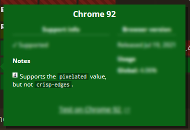
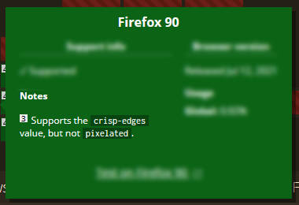
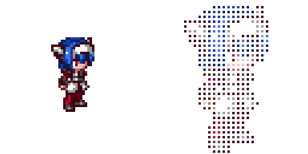
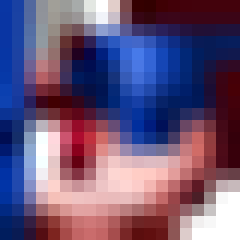
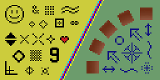

<style>
	dl.image-array {
		display: flex;
		flex-wrap: wrap;
		justify-content: space-evenly;
		gap: 1rem;
		border: none;
		background: none;
	}

	.image-array-item {
		flex: 0 0 10em;
	}

	.image-array dt, .image-array dd {
		text-align: center;
	}
</style>

<abbr title="Cascading Style Sheets">CSS</abbr> offers a nifty property called `image-rendering` which lets you influence how images scale. Normally, when you take a small image and make it bigger, the image becomes blurry. That's kinda ok for photos, but for pixelart, the effect is... rather devastating.

<figure>
	
	<figcaption><strong>Credit:</strong> Lea, a character from the game <a href="http://cross-code.com">Cross Code</a></figcaption>
</figure>

<details>
	<summary>What is <strong>pixelart</strong>?</summary>
	<p>Pixelart is a way of creating pictures. Rather than using brush strokes, each individual pixel is carefully colored. It's like if you were given just a few hundred square tiles and asked to make a mosaic out of them.</p>
</details>

However, thanks to `image-rendering`, it's possible to upscale images in a way that highlights their pixelated nature! Just a couple lines of code later and...

```css
.pixelart {
	/* This order matters! */
	image-rendering: crisp-edges;
	image-rendering: pixelated;
}
```

<iframe height="350" title="Codepen: image-rendering Example" src="https://codepen.io/auroratide/embed/RwVywNK?default-tab=result" frameborder="no" loading="lazy" allowtransparency="true" allowfullscreen="true">
	See the Pen <a href="https://codepen.io/auroratide/pen/RwVywNK">
	image-rendering Example</a> by Timothy Foster (<a href="https://codepen.io/auroratide">@auroratide</a>)
	on <a href="https://codepen.io">CodePen</a>.
</iframe>

...hooray! It looks fantastic!

_Except, wait just a second._ Why on earth does the above example CSS specify `image-rendering` twice, and with two different values? Something's fishy!

## The Paradox

It turns out there's a bit of a **paradox** in the browser support for `image-rendering`. Waddle on over to [Can I Use](https://caniuse.com/css-crisp-edges) and we see the following weirdness.

<figure>
	
	
	<figcaption>Chrome and Firefox notate that they support opposite properties</figcaption>
</figure>

That's right! Chrome supports `pixelated` but not `crisp-edges`, and Firefox supports `crisp-edges` but not `pixelated`. In order to support both browsers, both values had to be specified in the example above, utilizing the fact of CSS that if one value is invalid then the other will be used.

What I learned, though, is that resolving this paradox is **not** as simple as "just specify both properties", because the properties have different _semantics_. That is, even though `crisp-edges` and `pixelated` accomplish the same _result_, they _mean_ different things.

<p></p>

To resolve this, we'll need to embark on a mystical journey through different versions of the specification, discussions on implementations, and—

Well actually, I already did all that! Instead, I'll walk through what I discovered by answering three key questions:

* Why is there a paradox?
* What is the difference between `pixelated` and `crisp-edges`?
* What CSS should I use for pixelated images? What about for images with crisp edges?

## What's with the paradox?

Without being involved in the dialogue directly, it's hard to pinpoint the precise reasons why `image-rendering` has the support it has. After delving through documentation, discussions, and definitions <small>(oh my!)</small>, there was one truth underpinning it all.

<major-point>
	The rules for how <code>image-rendering</code> should work are not set in stone.
</major-point>

In fact, despite this property having first appeared in 2012, just a few months ago in <time datetime="2021-02-25">February 2021</time> the **[images specification](https://drafts.csswg.org/css-images-3/#the-image-rendering)** changed! And furthermore, it had seen periodic change over its nine-year history. In other words, `image-rendering` is undergoing active discussion, at least some of which has come from feedback from browsers implementing the feature for testing.

<details>
	<summary>What is the <strong>CSS Specification</strong>?</summary>
	<p>The specification is a set of documents detailing what the features of CSS are, how they should be used, and how they should be implemented by browsers. It's basically the source of truth for what CSS is and will be, and has been in constant development since its inception decades ago. Feel free to read more about the <a href="https://www.w3.org/Style/2011/CSS-process">CSS standardization process</a>.</p>
</details>

As a result, the property has only ever been implemented to different degrees, with Firefox and Chrome having taken different routes. And since the spec is still under discussion, no one has a complete implementation.

<p></p>

In the end, Firefox developed `crisp-edges` because it already supported the non-standard property `-moz-crisp-edges` which represents the nearest neighbor algorithm. Chrome had implemented `pixelated` because, at the time in 2014, the spec for `pixelated` was more straightforward.

If you want to learn more about the history, I've got some extra bits at the end of the article!

* [Timeline of image-rendering](#timeline-of-image-rendering)
* [What changed in February 2021?](#what-changed-in-february-2021)

## Pixelated or Crisp Edges?

To grasp the `pixelated` and `crisp-edges` values, it's important to understand the purpose of the `image-rendering` property. 

### The Semantics of image-rendering

I'm gonna unoriginally paste a direct quote from the CSS spec, emphasis added:

<blockquote cite="https://www.w3.org/TR/2020/CRD-css-images-3-20201217/">

The image-rendering property provides a hint to the user-agent about **what aspects of an image are most important to preserve** when the image is scaled...

</blockquote>

When an image is scaled, the computer either has to fill in missing details when scaled up or choose what to collapse when scaled down. That can be tricky, kinda like doubling a cooking recipe but realizing you don't have enough ingredients. And so, there's no single correct strategy for scaling images, leading to a diversity of **scaling algorithms** meant to do the job.

<figure>
	
	<figcaption>Scaling algorithms fill in the gaps.</figcaption>
</figure>

That said, notice that the spec does _not_ say that the purpose of `image-rendering` is to choose a scaling algorithm. Rather, the goal is to specify <q cite="https://www.w3.org/TR/2020/CRD-css-images-3-20201217/">what aspects of an image are most important to preserve</q>. For example, when we scale an image, do we care more about the way colors blend, or about keeping the edges sharp? Depending on the answer, one algorithm may be better than another.

Though a scaling algorithm will be ultimately chosen, the point of `image-rendering` is really to provide the browser additional information so it knows better how to treat the image!

### The Semantics of pixelated and crisp-edges

Knowing that `image-rendering` is all about identifying what aspects of the image are important to preserve, we can see how `pixelated` and `crisp-edges` are defined.

<dl>
	<dt class="info">pixelated</dt>
	<dd>The image is scaled in a way that <strong>preserves the pixelated nature</strong> of the original as much as possible.</dd>
	<dt class="info">crisp-edges</dt>
	<dd>The image is scaled in a way that <strong>preserves contrast and edges</strong>, and which does not smooth colors or introduce blur to the image in the process.</dd>
</dl>

For pixelated images, the emphasis is on the pixels, but for crispy images, the emphasis is on the edges. The key point here is that pixels are _not_ the same as edges!

<major-point>
	The <code>pixelated</code> and <code>crisp-edges</code> values are not semantically interchangeable.
</major-point>

We can illustrate the difference by scaling up our pixelart Lea image by a non-integral factor, say 2.5 times the original size, using algorithms the spec currently mandates.

<details><summary>What algorithms does the spec mandate?</summary>

For `crisp-edges`, the [nearest neighbor](https://tech-algorithm.com/articles/nearest-neighbor-image-scaling/) algorithm is used.

For `pixelated`, nearest neighbor is used to take the image to the nearest integer scale. Afterward, a smooth-scaling algorithm takes the image the rest of the way.

</details>

<figure>
	
	<figcaption>The original image for reference</figcaption>
</figure>

<dl class="image-array">
	<div class="image-array-item">
		<dt>pixelated</dt>
		<dd></dd>
	</div>
	<div class="image-array-item">
		<dt>crisp-edges</dt>
		<dd></dd>
	</div>
	<div class="image-array-item">
		<dt>auto</dt>
		<dd></dd>
	</div>
</dl>

Because the image is scaled by a non-integer, the resulting enlarged "pixels" cannot all be the same size. Therefore, a compromise must be made, and the different rendering values make different compromises as a result of their semantics.

* For `pixelated`, pixels must be square, and the only way to preserve that property is to allow the enlarged pixels to overlap. The blurring on cell boundaries represent places where pixels are overlapping.
* For `crisp-edges`, blurring is not allowed since the contrast between colors is most important. Resizing a pixelart image, therefore, results in cells that are not square, which distorts the pixelation aesthetic.
* And `auto`, the browser default and included here mostly for reference, treats the image like a photo where smoothing is both allowed and expected.

## Resolving the Paradox

Equipped with the history and semantics of `image-rendering`, we can resolve the paradox!

For pixelart, it is clear the `pixelated` value should be used; that's what most closely matches the semantics of the art. However, since Firefox does not yet support `pixelated`, we can fall back onto its currently provided solution, `crisp-edges`, which will resolve to the nearest neighbor algorithm.

```css
.pixelart {
	image-rendering: crisp-edges;
	image-rendering: pixelated;
}
```

The fact that `pixelated` is last is _very important_! If we imagine a future where Firefox has implemented `pixelated`, then we want that value to be applied instead of `crisp-edges`. Letting the most semantically appropriate value be last future-proofs the solution.

> [!TIP]
> For maximum compatibility, the undead Internet Explorer browser can be supported with `-ms-interpolation-mode: nearest-neighbor`.

----------

And what about images which should have high contrast?

Chrome and Safari do not support `crisp-edges`, but instead support a webkit property called `-webkit-optimize-contrast` which bears similar semantics. Therefore, rather than use `pixelated`, it is better to use something that more closely resembles what `crisp-edges` means:

```css
.crispy-art {
	image-rendering: -webkit-optimize-contrast;
	image-rendering: crisp-edges;
}
```

--------------

And with that, we can celebrate with the final demo!

<iframe height="368" title="image-rendering Example End" src="https://codepen.io/auroratide/embed/wvdYgwv?default-tab=result" frameborder="no" loading="lazy" allowtransparency="true" allowfullscreen="true">
	See the Pen <a href="https://codepen.io/auroratide/pen/wvdYgwv">
	image-rendering Example End</a> by Timothy Foster (<a href="https://codepen.io/auroratide">@auroratide</a>)
	on <a href="https://codepen.io">CodePen</a>.
</iframe>

<icon-divider icon="square-full"></icon-divider>

## Extra Stuff

The article's basically done now, but if you want more I got more!

### Resources

* Pixelart is of Lea from the game [Cross Code](http://cross-code.com) by [Radical Fish Games](http://www.radicalfishgames.com/) - I highly recommend this game
* [Can I Use](https://caniuse.com/css-crisp-edges) - current browser support for `image-rendering`
* <cite><a href="https://drafts.csswg.org/css-images-3/#the-image-rendering">CSS Images Module Level 3</a></cite> - the current Editor's Draft of the specification for CSS images
* [Chromium Issue](https://bugs.chromium.org/p/chromium/issues/detail?id=317991) - Tracking Chrome's supprt
* [Mozilla Issue](https://bugzilla.mozilla.org/show_bug.cgi?id=856337) - Tracking Firefox's support
* [Pixelated Github Issue](https://github.com/w3c/csswg-drafts/issues/5837) - Tracking recent updates to the spec

### Timeline of image-rendering

As part of my research, I tried to uncover as much of the history of `image-rendering` as I could. Here's the best timeline I'm able to come up with.

<dl>
	<dt>September 2012</dt>
	<dd><code>image-rendering</code> first appeared in a draft of the CSS Specification.</dd>
	<dd>See <cite><a href="https://www.w3.org/TR/2012/WD-css4-images-20120911/#the-image-rendering">CSS Image Values and Replaced Content Module Level 4</a></cite>, archived from 2012</dd>
	<dt>November 2013</dt>
	<dd>Browsers began implementing the <code>pixelated</code> value.</dd>
	<dd>See the <a href="https://bugs.chromium.org/p/chromium/issues/detail?id=317991">Chromium Issue</a> for Chrome, and <a href="https://bugzilla.mozilla.org/show_bug.cgi?id=856337">Mozilla Issue</a> for Firefox</dd>
	<dt>September 2014</dt>
	<dd>Behind-the-scenes discussions surfaced difficulty in implementing downscaling, and so the specification was revised to loosen requirements.</dd>
	<dd>See the <a href="https://lists.w3.org/Archives/Public/www-style/2014Sep/0351.html">mailing list summarizing the discussion</a></dd>
	<dt>October 2014</dt>
	<dd>Firefox deprioritized implementing <code>pixelated</code>, because doing so required substantial changes and testing. Since Firefox already offered <code>-moz-crisp-edges</code> which accomplished the same result, it was deemed sufficient.</dd>
	<dd>See <a href="https://bugzilla.mozilla.org/show_bug.cgi?id=1072703#c17">Downscaling Mozilla Issue</a></dd>
	<dt>December 2014</dt>
	<dd>Chrome finished implementing <code>pixelated</code>, using the Nearest Neighbor algorithm for both upscaling and downscaling.</dd>
	<dd>See <a href="https://bugs.chromium.org/p/chromium/issues/detail?id=317991#c15">Chromium Issue</a></dd>
	<dt>November 2018</dt>
	<dd>Firefox unprefixed <code>-moz-crisp-edges</code>, thereby officially supporting <code>crisp-edges</code>.</dd>
	<dd>See <a href="https://bugzilla.mozilla.org/show_bug.cgi?id=1496617">Crisp Edges Mozilla Issue</a></dd>
	<dt>October 2019</dt>
	<dd>The <code>image-rendering</code> property is moved from the level 4 spec into level 3, and made into a candidate recommendation.</dd>
	<dd>See <cite><a href="https://www.w3.org/TR/2019/CR-css-images-3-20191010/#the-image-rendering">CSS Images Module Level 3</a></cite>, archived from 2019</dd>
	<dt>January 2021</dt>
	<dd>An issue is raised on Github with concerns on the spec definition for <code>pixelated</code>. The concern was the algorithm recommended by the spec did not adequately fulfill the intended semantics of the value.</dd>
	<dd>See <a href="https://github.com/w3c/csswg-drafts/issues/5837">Pixelated Github Issue</a></dd>
	<dt>February 2021</dt>
	<dd>The Editor's Draft of the CSS Images Spec is updated to reflect new recommendations for <code>pixelated</code> and <code>crisp-edges</code> given the Github issue a month earlier.</dd>
	<dd>See <cite><a href="https://drafts.csswg.org/css-images-3/#the-image-rendering">CSS Images Module Level 3</a></cite>, the current Editor's Draft</dd>
</dl>

### What changed in February 2021?

In <time datetime="2021-02-25">February 2021</time>, the CSS specification for `image-rendering` was updated in a non-trivial way. Although the semantics for `pixelated` and `crisp-edges` remained the same, the recommended algorithms for each changed.

It's easiest to see the change when comparing the description for `pixelated` between the current Candidate Recommendation (from <time datetime="2020-12-17">December 2020</time>) and the more recent Editor's Draft:

<dl>
  <dt class="danger">Candidate Recommendation</dt>
  <dd>The image must be scaled with the "nearest neighbor" or similar algorithm, to preserve a "pixelated" look as the image changes in size.</dd>
  <dt class="success">Editor's Draft</dt>
  <dd>For each axis, independently determine the integer multiple of its natural size that puts it closest to the target size and is greater than zero. Scale it to this integer-multiple-size as for crisp-edges, then scale it the rest of the way to the target size as for smooth.</dd>
</dl>

Meanwhile, `crisp-edges` was changed to explicitly call for the nearest neighbor algorithm.

This change was introduced in order to better fit the semantics of `pixelated`. The nearest neighbor algorithm does not preserve the squareness of pixels when sized to non-integer scales; the new algorithm, on the other hand, introduces some blurring along pixel borders, but overall retains the gridded look pixelart should have.

Perhaps more interesting, however, is the change to `crisp-edges`. Although the semantic definition of the value is unchanged, the provided example is dramatically different. Both images below represent the same source image being upscaled several times, but are from different versions of the spec.

<div style="display: grid; grid-template-columns: 1fr 1fr;">
	<figure>
		
		<figcaption>Before the change</figcaption>
	</figure>
	<figure>
		
		<figcaption>After the change</figcaption>
	</figure>
</div>

Long story short, this property has been and presently is a point of discussion.
