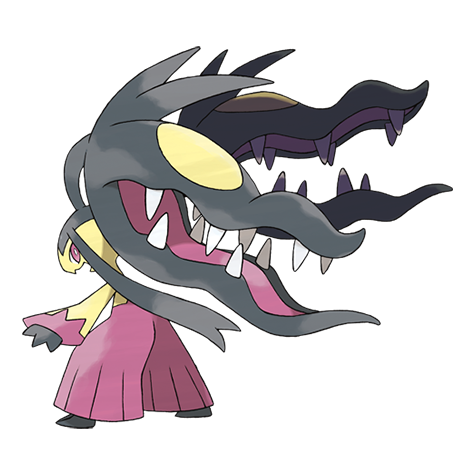
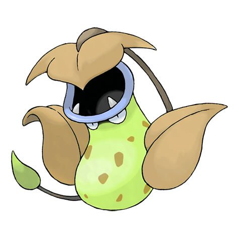
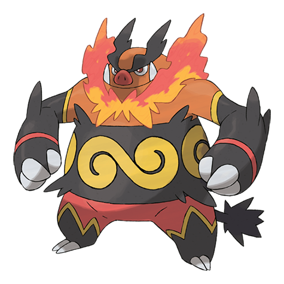
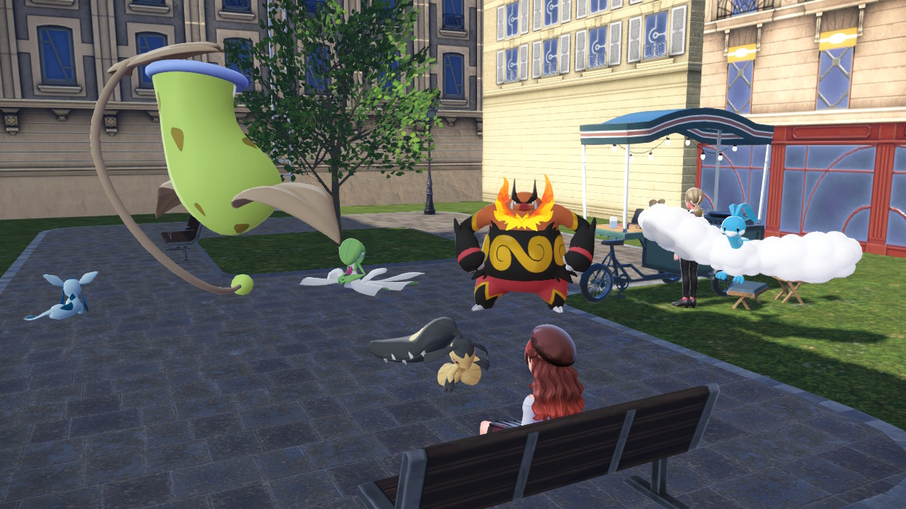
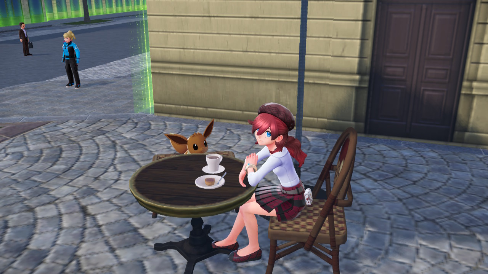
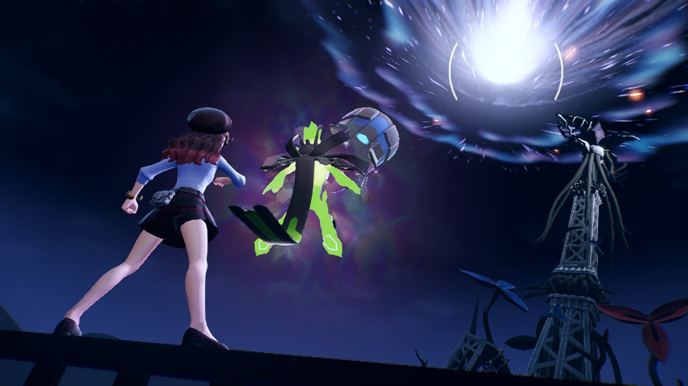

I _finally_ finished playing Pokémon Z-A, and I gotta be honest: I really enjoyed this game overall, for both its gameplay and storytelling.

Is it of the quality expected from the biggest franchise in the world? Perhaps not. Is it an improvement over the messy Scarlet/Violet? In many ways yes. Was it fun and worth my time? For me, yep!

I haven't done reviews in the past, but I wanted to start for two reasons:

1. If I wanna do more interactive storytelling, it'd be good to learn from others!
2. At least for Pokémon specifically, I wanted to dispel some of the pessimism people have had toward the franchise. A lot of the pessimism is valid, but it's not _all bad_, and with ZA specifically, I saw not just good, but what I could only describe as a feeling that this was built by people with "love for the game". And that's meaningful to me.

> [!NOTE]
> **Not** sponsored or anything! I'm just writing this because I wanna. The "Lessons Learned" bits might help future me!

Anyways, I'll break down the game's **Gameplay**, **Setting**, and **Story** like this:

* What I liked
* What could be improved to make me like it more
* And takeaway lessons for myself when making my own stuff

## But first, what was your final team??

<ul id="pokemon-list">
  <li>
    
Bliss

    
    <ul class="moves">
      <li class="normal">Swords Dance</li>
      <li class="steel">Iron Head</li>
      <li class="fairy">Play Rough</li>
      <li class="fighting">Dynamic Punch</li>
    </ul>
  </li>
  <li>
    
Shame

    
    <ul class="moves">
      <li class="poison">Sludge Wave</li>
      <li class="bug">Leech Life</li>
      <li class="dark">Knock Off</li>
      <li class="grass">Power Whip</li>
    </ul>
  </li>
  <li>
    
Anger

    
    <ul class="moves">
      <li class="fire">Flamethrower</li>
      <li class="fire">Heat Wave</li>
      <li class="fighting">Close Combat</li>
      <li class="rock">Head Smash</li>
    </ul>
  </li>
  <li>
    
Confusion

    
    <ul class="moves">
      <li class="psychic">Psyshock</li>
      <li class="fairy">Moonblast</li>
      <li class="psychic">Psychic</li>
      <li class="psychic">Calm Mind</li>
    </ul>
  </li>
  <li>
    
Sadness

    
    <ul class="moves">
      <li class="dragon">Dragon Rush</li>
      <li class="flying">Hurricane</li>
      <li class="dragon">Dragon Pulse</li>
      <li class="ground">Earthquake</li>
    </ul>
  </li>
  <li>
    
Gleevee

    
    <ul class="moves">
      <li class="ice">Blizzard</li>
      <li class="normal">Hyper Beam</li>
      <li class="ice">Freeze-Dry</li>
      <li class="psychic">Calm Mind</li>
    </ul>
  </li>
</ul>

<figure class="h-15">
  
    
  </img-zoom>
  <figcaption>Ok it's actually really hard to get all the pokemon in a single shot, lol.</figcaption>
</figure>

## Gameplay

ZA is notable for changing the way the game is played: instead of battling in a turn-based way, everything is real-time with cooldowns.

**Easily my favorite part of the game.**

After having played ZA, I realized what my "ideal" Pokémon game would be: A _truly_ open world (NOT the way Scarlet/Violet did, but better) with polished real-time combat and a level of danger to the trainer.

And the reason is simple. For the first time ever playing a pokémon game, I _felt_ like a real trainer. Issuing commands, reacting to the opponent's actions, running around while battling, frenetically fleeing an ambush of wild pokémon, etc.

Mechanically, I noticed a few of things:

* Pokémon battles are complicated, and that translates to the controls. For example, pressing all the right buttons to switch a pokémon in while combat is happening was tricky. It might have felt clunky for some, but I ironically _liked_ the clunkiness, because I imagined, "You know, in a _real_ pokémon battle this would actually be a pretty tough skill to learn and time."
* I wasn't just clicking the strongest move all the time. I was using my pokémon's entire arsenal of moves in every combat.
* Positioning and timing mattered. Dodging moves by running and executing my own move on time felt good.
* Wild battles felt dangerous. Not _hard_, just that it's fun to worry about the trainer's safety too.

### Ideas for Improvement

ZA is a great _experiment_ when it comes to real-time battles, though it is admittedly shallow. Fine for a first time, but I want more!

* What if I could cancel a move to make a carefully timed pivot, or bait my opponent?
* What if I had a bit more explicit control over where the pokemon is?
* The status effects could have been more impactful (barely noticed paralysis and sleep).
* I wish we had abilities back!

And my last idea (even if probably controversial):

* Is it possible to elimiate the _level system_? I want to outskill my opponent, not crush them with raw stats!

### Lessons for Me

* Game mechanics are the ultimate form of "show, don't tell". It's like, "show by feeling, not just visualizing".
* Use interactions as a way to _create empathy_ for the characters in world, rather than just as a means to control.

## Setting

The entire game takes place in Lumiose City. Which is admittedly a very tiny setting, made tinier by the fact that... there wasn't _that much_ to actually do in the city.

I must say, I did enjoy the funny scaffolding obstacle courses. I suddenly found myself desperately wishing that we had such things when I was a kid, though of course that would _never_ fly in the real world ^^'

<figure class="h-15">
  
    
  </img-zoom>
  <figcaption>Eevee, you can't eat human food.</figcaption>
</figure>

### Ideas for Improvement

* The Wild Zones are not an adequate substitute for exploring routes and such, simply because they're too small.
* I like the concept of the Battle Zones (I kept calling them "[Purge Events](https://en.wikipedia.org/wiki/The_Purge)" just to be funny), but it felt a little lame that every trainer you encounter is your own level. In reality it would be spread out: you could get jumped by trainers significantly stronger than you, and you could bully newcomers out of the league. Not that being purely realistic is good (if everyone is weaker than you, it stops being fun), but more of a balance would have suspended my disbelief longer.
* I wish there was more to do in an entire city than drink coffee, shop, and visit a museum! Cities have so much to do in reality, adding a few more activities and depth to those activities would make the city _feel_ bigger even if it isn't physically bigger.

### Lessons for Me

* I'm (slowly) [making a city of my own](https://ematea.city). It will be important to find ways to make the world feel _full_.
* ZA does benefit from being _focused_. Balancing focus on the main story and creating options to explore is important. I don't want to be as small as ZA's city, but also probably not as big as Skyrim's world and all the things you can do there.

## Story and Characters

> [!CAUTION]
> **This section will contain spoilers for the story and characters.**
> 
> **If you want to experience the game yourself, [skip to the comments](#comments)!**

By the time I reached the end of the game, I realized that every major character was in some way memorable. Not just because I liked every design, but because each ally and antagonist had a distinct personality, involvement in the story, and _actual screentime_.

* Naveen, the no-nonsense rival who is ironically a streamer fanboy.
* Lida, the dancer who focuses on building team spirit and morale.
* Canari, the streamer with a bad attitude off screen (and is basically Iono but better don't hate me).
* Ivor, the strong tough guy with a soft spot for his fans and vision for harmony with Pokémon.
* Corbeau, the mob boss who uses his underworld influence to handle cases the city's enforcement won't or can't.
* Jacinthe, the posh lady who always gets what she wants, somehow with the mildest-mannered wrath.
* Urbain, the guy who _got us all into debt_, _did nothing about it_, then _almost destroyed the whole city and deserves exile_.

This is rather rare in Pokémon games. Like, in Scarlet/Violet I can't even remember who all the gym leaders are, and Nemona's personality could be boiled down to "I wanna battle you!" I genuinely liked every character in ZA. Even you, Urbain.

And though the story may not have been deep, it wasn't _shallow_ either. I ended up appreciating the _environmental storytelling_:

* As more wild zones open, people in the city start questioning them more, making the city feel alive.
* As the rogue mega evolutions occur, more and more mega shard clusters appear, adding to a sense of urgency.
* Zygarde appearing more frequently as the player character shows more promise.

Ultimately though, the game shines with its characters and your bonds with them. In the end sequence, each character you had met helps in some way in the final confrontation. Playing through it, I felt like my character didn't just fight a bunch of people and saved the day. She came to a city on a whim, made bonds with some of its people, and relied on those bonds to make some kind of difference.

Myself, as someone who flits from city to city, I wish I was that cool :P

<figure class="h-15">
  
    
  </img-zoom>
  <figcaption>I like this scene</figcaption>
</figure>

### Ideas for Improvement

* I don't think Pokémon games really _need_ a deep story, though I wish the stakes and tension were more evident. I don't like vague "things are getting worse" plots which don't concretely show _why_ things are getting worse, and therefore what the characters can actually do about it besides "get to the highest rank and somehow that's good enough".
* The final boss sequence was cinematic, and I loved that. However, the battle itself was a bit lackluster, and would have felt more epic if the three phases were significantly different from each other, or if I had to pay attention to type strengths/weaknesses (all damage at the end was typeless for some reason, weird for a Pokémon game).
* Urbain would be a much better character if he actually developed from his mistakes rather than being aggressively forgiven by his friends all the time.

### Lessons for Me

* Memorable characters don't just say things. They _do_ things. They affect the plot, and they affect the main character.
* As the story progresses, change the environment. Show that the world evolves over time, and in response to the things characters do.
* Make character motivations make sense relative to the plot's main complication.

## What now?

Well I had never played the Legends Arceus game. So I guess I will now!

