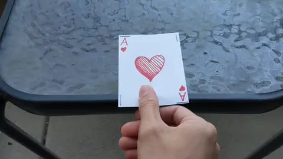

There are a lot of cards on the internet, and a lot of them flip, revealing double-sided content. But the way so many of them flip is not... _anatomically correct_.

My old writing classes told me to show rather than tell: Which one of these cards _feels_ better?

<iframe height="600" title="Codepen: Card Flip Comparison" src="https://codepen.io/auroratide/embed/WNmmQzP?default-tab=result" frameborder="no" loading="lazy" allowtransparency="true" allowfullscreen="true" aria-describedby="first-demo-description">
  See the Pen <a href="https://codepen.io/auroratide/pen/WNmmQzP">
  Flip Card Comparison</a> by Timothy Foster (<a href="https://codepen.io/auroratide">@auroratide</a>)
  on <a href="https://codepen.io">CodePen</a>.
</iframe>

<div id="first-demo-description">

> [!NOTE]
> The first card, a Pichu, does a normal 180-degree turn. The second card, a Raichu, lifts up off the page while doing a 180-degree turn.

</div>

The Pichu card is how basically every tutorial tells you how to make a card flip animation. Thing is, real-life cards just don't work that way...

<figure class="h-15">
	
		
	</img-zoom>
	<figcaption>Cards cannot flip <em>into</em> the table.</figcaption>
</figure>

The Raichu card realizes two subtle details:

* A real-life card needs to be lifted to be flipped.
* A real-life card has thickness.

<major-point>

Subtlety is the difference between something feeling _good_ and something feeling _satisfying_.

</major-point>

* [Level -1: Cheating with a component](#level--1-cheating-with-a-component)
* [Level 0: The Basic Card](#level-0-the-basic-card)
* [Level 1: Verticality](#level-1-verticality)
* [Level 2: Thickness](#level-2-thickness)
* [Level 3: Round Corners + Thickness](#level-3-round-corners--thickness)
* [Level 🧠: Keep Accessibility in mind!](#level--keep-accessibility-in-mind)

## Level -1: Cheating with a component

I was originally going to just write about how to make a cool flip animation, but I got a _little_ carried away and ended up creating a fully reusable component. Oops 🙂

Install **[@auroratide/flip-card](https://github.com/Auroratide/web-components/tree/main/components/flip-card)** and you get a **web component** which can be used in any framework, be it React, Svelte, Vue, or vanilla.

```html
<flip-card>
	<section slot="front">
		<p>The front!</p>
	</section>
	<section slot="back">
		<p>The back!</p>
	</section>
</flip-card>
```

<details>
	<summary>What is a <strong>web component</strong>?</summary>
	<p>Web components create new semantics through custom HTML elements. If you ever told yourself, "Dang, I wish <em>this</em> were just a regular HTML element," then web components let you do just that: make it one!</p>
	<ul>
		<li><a href="https://developer.mozilla.org/en-US/docs/Web/API/Web_Components">Read more about web components</a></li>
		<li><a href="/posts/making-a-toggle-switch">A step-by-step tutorial in building a custom element</a></li>
	</ul>
</details>


## Level 0: The Basic Card

The basic card we know and love relies on a few key CSS features:

* [Absolute positioning](https://developer.mozilla.org/en-US/docs/Web/CSS/position#absolute_positioning)
* [3D transformations](https://developer.mozilla.org/en-US/docs/Web/CSS/CSS_transforms/Using_CSS_transforms#3d_specific_css_properties) - specifically [rotateY](https://developer.mozilla.org/en-US/docs/Web/CSS/transform-function/rotateY) and [perspective](https://developer.mozilla.org/en-US/docs/Web/CSS/perspective)
* [Backface visibility](https://developer.mozilla.org/en-US/docs/Web/CSS/backface-visibility)

It's really just two same-sized section boxes on top of each other, with one flipped 180 degrees and its backside invisible. Then rotate their container to reveal the second box's content.

A ton of tutorials already go into detail about how this works, so I'll just link all the appropriate documentation and throw some annotated code here. This'll serve as the base for climbing the Ladder of Card-Flip Enlightenment.

<div class="success">

**HTML**
```html
<article class="perspective-container">
   <div class="card">
      <section class="front face" aria-hidden="false"></section>
      <section class="back face" aria-hidden="true"></section>
   </div>
</article>
```

</div>

**CSS**
```css
.perspective-container {
   perspective: 100em; /* creates an illusion of depth */
   perspective-origin: center;
}

.card {
   width: 15em;
   aspect-ratio: 5 / 7;
   position: relative;
   transform-style: preserve-3d;
}

.card .face {
   /* Hide the backside of the element, for when it is rotated */
   backface-visibility: hidden;
}

.card .back {
   /* The front and back elements occupy the same space */
   position: absolute;
   inset: 0;
   transform: rotateY(180deg);
}

.card section {
   width: 100%;
   height: 100%;
}

/* Later sections will add code to actually flip the card */
/* We'll be applying transformations to the .card class mainly */
```

## Level 1: Verticality

When you flip a real-life card, you have to lift it off the surface first, otherwise the card melds into the table. Or more realistically the card _bends_, cursing you for 7 years.

The traditional approach uses the `transition` CSS property, but all it's able to do is smoothly take you from one state (`rotateY(0deg)`) to a different state (`rotateY(180deg)`). In the case of lifting a card, the start and end states are the same. We need a _middle_ state where the card is lifted vertically, therefore we need a more powerful CSS tool.

Let's use [@keyframes](https://developer.mozilla.org/en-US/docs/Web/CSS/@keyframes) and [animation](https://developer.mozilla.org/en-US/docs/Web/CSS/animation)!

<iframe height="600" title="Codepen: Verticality Demo" src="https://codepen.io/auroratide/embed/xxBBdmo?default-tab=css%2Cresult" frameborder="no" loading="lazy" allowtransparency="true" allowfullscreen="true">
  See the Pen <a href="https://codepen.io/auroratide/pen/xxBBdmo">
  Flip Verticality Demo</a> by Timothy Foster (<a href="https://codepen.io/auroratide">@auroratide</a>)
  on <a href="https://codepen.io">CodePen</a>.
</iframe>

<details><summary>Give me annotated code!</summary>

**CSS**
```css
@keyframes flip-to-front {
   0% { transform: translateZ(0em) rotateY(-180deg); }
   50% { transform: translateZ(var(--flip-height)) rotateY(-270deg); }
   100% { transform: translateZ(0em) rotateY(-360deg); }
}

/* I'm using a second animation for two reasons: 
 *  1. It allows the card to always flip in one direction.
 *  2. The renderer only plays an animation if it changes.
 */
@keyframes flip-to-back {
   0% { transform: translateZ(0em) rotateY(0deg); }
   50% { transform: translateZ(var(--flip-height)) rotateY(-90deg); }
   100% { transform: translateZ(0em) rotateY(-180deg); }
}

.card {
   --flip-height: 17.5em;
   
   animation-duration: 0.75s;
   animation-fill-mode: both;
   animation-timing-function: linear;
   /* NOTE: We're NOT setting the animation with CSS */
   /* By using Javascript, it's easier to prevent the animation from playing as soon as the page loads. */
}
```

<div class="warning">

**Javascript**
```javascript
function flipCard(card) {
   card.classList.toggle("facedown")
   const isFacedown = card.classList.contains("facedown")

   card.style.animationName = isFacedown
      ? "flip-to-back"
      : "flip-to-front"
}
```

</div>

</details>

## Level 2: Thickness

Real-life cards have small, albeit non-zero, thickness. And with the power of 3D CSS, we can give our virtual cards thickness too! The effect is subtle but makes the rotation feel much more physical.

The strategy here is to assemble four empty `div` blocks, representing the card's edges. We'll make them as wide/high as the card's thickness, `position` them along the card's borders, and then `rotateY` them into the page.

<iframe height="600" title="Codepen: Thickness Demo" src="https://codepen.io/auroratide/embed/KKEEqzG?default-tab=css%2Cresult" frameborder="no" loading="lazy" allowtransparency="true" allowfullscreen="true">
  See the Pen <a href="https://codepen.io/auroratide/pen/KKEEqzG">
  Card Thickness Demo</a> by Timothy Foster (<a href="https://codepen.io/auroratide">@auroratide</a>)
  on <a href="https://codepen.io">CodePen</a>.
</iframe>

<details><summary>Give me annotated code!</summary>
<div class="success">

**HTML**
```html
<div class="card">
   <section class="front face" aria-hidden="false"></section>
   <section class="back face" aria-hidden="true"></section>
   <!-- NEW! We need divs that represent the 4 edges -->
   <div class="top edge"></div>
   <div class="right edge"></div>
   <div class="bottom edge"></div>
   <div class="left edge"></div>
</div>
```

</div>

**CSS**
```css
.card {
   --card-depth: 0.25em;
   /* Without special corner logic, a card with thickness cannot have border radius */
   border-radius: 0;
}

.card .back {
   /* Push the back of the card backward to give space for the edges to live */
   transform: translateZ(calc(-1 * var(--card-depth))) rotateY(180deg);
}

.edge {
   position: absolute;
   background-color: black;
}

/* All of this code is aligning the edges, rotating them into the page */
.right, .left {
   width: var(--card-depth);
   height: 100%;
   inset-block: 0;
} .right {
   inset-inline-end: 0;
   transform: rotateY(270deg);
   transform-origin: right center;
} .left {
   inset-inline-start: 0;
   transform: rotateY(90deg);
   transform-origin: left center;
}

.top, .bottom {
   width: 100%;
   height: var(--card-depth);
   inset-inline: 0;
} .top {
   inset-block-start: 0;
   transform: rotateX(270deg);
   transform-origin: center top;
} .bottom {
   inset-block-end: 0;
   transform: rotateX(90deg);
   transform-origin: center bottom;
}
```

</details>

## Level 3: Round Corners + Thickness

Ever tried making a rotating cylinder with CSS? Turns out you can't, because CSS doesn't have 3D curved surfaces. The most reasonable way is to [_simulate_ a cylinder](https://daily-dev-tips.com/posts/creating-a-3d-cylinder-shape-in-css/) with a bunch of thin flat surfaces.

Once our card acquires thickness, any rounded corners suddenly become quarter-cylinders. Therefore, we need <del>advanced magic</del> <ins>math</ins> to make them look correct!

The strategy is to simulate each rounded corner as a series of small, flat `divs` arranged into quarter-circles whose radii are equal to the card's border radius. The number of `divs` we use is what I'm calling the `--corner-granularity`. Higher corner granularity means a smoother corner, but more `divs` being used.

<iframe height="600" title="Codepen: Round 3D Corners Demo" src="https://codepen.io/auroratide/embed/gOEERze?default-tab=css%2Cresult" frameborder="no" loading="lazy" allowtransparency="true" allowfullscreen="true">
  See the Pen <a href="https://codepen.io/auroratide/pen/gOEERze">
  Round 3D Corners Demo</a> by Timothy Foster (<a href="https://codepen.io/auroratide">@auroratide</a>)
  on <a href="https://codepen.io">CodePen</a>.
</iframe>

<details><summary>Give me annotated code!</summary>
<div class="success">

**HTML**
```html
<div class="card">
   <!-- ...front, back, sides... -->
   <div class="top-right corner">
      <div style="--i: 0;"></div>
      <div style="--i: 1;"></div>
      <div style="--i: 2;"></div>
   </div>
   <div class="bottom-right corner">
      <div style="--i: 0;"></div>
      <div style="--i: 1;"></div>
      <div style="--i: 2;"></div>
   </div>
   <div class="bottom-left corner">
      <!-- ... -->
   </div>
   <div class="top-left corner">
      <!-- ... -->
   </div>
</div>
```

</div>

**CSS**
```css
.card {
   /* The number of faces used to simulate a round corner. More faces means more smooth. */
   --corner-granularity: 3;
   --border-radius: 1.5em;
   border-radius: var(--border-radius);
}

.corner > * {
   background-color: black;
}

/* We have to override the edges so they do not overlap the corners */
.right, .left {
   inset-block: var(--border-radius);
   height: calc(100% - 2 * var(--border-radius));
} .top, .bottom {
   inset-inline: var(--border-radius);
   width: calc(100% - 2 * var(--border-radius));
}

.corner {
   --n: var(--corner-granularity);
   --r: var(--border-radius);
   
   position: absolute;
   transform-style: preserve-3d;
}

/* A corner is composed of a finite number of flat faces that, when arranged in just the right way, looks rounded. */
/* We need to do it this way because curved 3D surfaces do not exist in CSS. */
.corner > * {
   position: absolute;
   inset-block-end: 0;
   width: var(--card-depth);
   height: calc(2 * var(--r) * sin(45deg / var(--n)));
   transform-origin: bottom center;
  
   /* This math constructs a single corner. */
   /* I derived it on a paper somewhere and threw it away, */
   /* so you'll have to derive it yourself if you want to understand what's happening (: */
   transform:
      translateZ(calc(var(--r) * cos(var(--i) * 90deg / var(--n))))
      translateY(calc(-1 * var(--r) * sin(var(--i) * 90deg / var(--n))))
      rotateX(calc(45deg * (2 * var(--i) + 1) / var(--n)));
}

/* The rest of this code slots the corners where they belong. */
.top-right {
   inset-block-start: 0;
   inset-inline-end: 0;

   transform:
      rotateY(90deg)
      translateZ(calc(-1 * var(--r)))
      translateY(var(--r));
} .bottom-right {
   inset-block-end: 0;
   inset-inline-end: 0;

   transform:
      rotateY(90deg)
      rotateX(270deg)
      translateZ(calc(-1 * var(--r)))
      translateY(var(--r));
} .bottom-left {
   inset-block-end: 0;
   inset-inline-start: 0;

   transform:
      rotateY(90deg)
      rotateX(180deg)
      translateZ(calc(-1 * var(--r)))
      translateY(var(--r));
} .top-left {
   inset-block-start: 0;
   inset-inline-start: 0;

   transform:
      rotateY(90deg)
      rotateX(90deg)
      translateZ(calc(-1 * var(--r)))
      translateY(var(--r));
}
```

</details>

<a id="#level-%F0%9F%A7%A0-keep-accessibility-in-mind"></a>
## Level 🧠: Keep Accessibility in mind!

**Accessibility** is the practice of considering all the people who might use your website and making it usable by as many of them as possible. Flippy cards can create a few pitfalls if we're not careful!

* What if the person cannot use a mouse? Is hover the only way to flip your card?
* What if the person uses the <kbd>Tab</kbd> key to navigate? Will they run into a button hidden on the backside of your card?
* What if the person uses a **[screenreader](https://webaim.org/techniques/screenreader/)** to read the page's content aloud? Will it read content hidden on the backside of the card?
* What if the person prefers less animation? Will the card's flip animation be jarring to them?

While it isn't the point of this article explore accessibility, these are nonetheless important questions to consider. Here are some tools you can use to address them.

* [aria-hidden](https://developer.mozilla.org/en-US/docs/Web/Accessibility/ARIA/Attributes/aria-hidden)
* [inert](https://developer.mozilla.org/en-US/docs/Web/HTML/Global_attributes/inert)
* [prefers-reduced-motion](https://developer.mozilla.org/en-US/docs/Web/CSS/@media/prefers-reduced-motion)

## Obligatory Conclusion

Ok I admit, nothing's actually _wrong_ with the normal card flip and the tutorials that teach it ❤️ I mean, why can't it represent a card flip happening in mid-air?

I just wanted to share something I tried and liked, and if you like it, feel free to use it too!

* [@auroratide/flip-card](https://github.com/Auroratide/web-components/tree/main/components/flip-card) web component
* [Card Flip Codepen Collection](https://codepen.io/collection/JGxVRZ)
