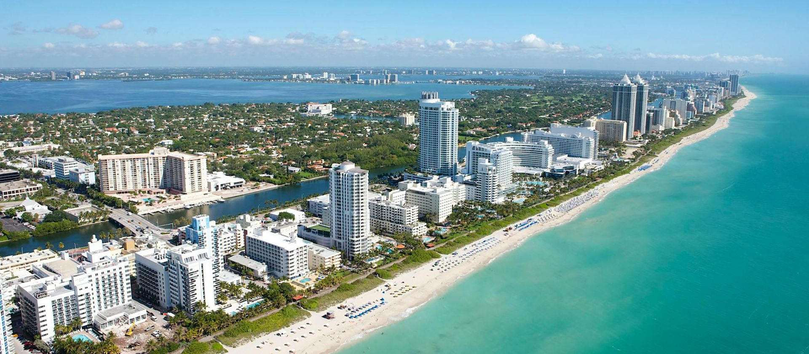

A <dfn>sensescape</dfn> describes the experiences of sight, smell, and sound of a particular place. When you recall the last time you were in a forest and remember the scent of pine pushed by the brushing branches swaying against the breeze, you are recalling that place's sensescape.

This isn't a word you'll find in any dictionary. I sort of just made it up while trying to describe why a character in a story I'm <small>(slowly)</small> writing likes a particular spot along the Miami coast.

<figure class="h-15">
	
		
	</img-zoom>
	<figcaption>Miami beaches, photo by <a href="https://www.pexels.com/photo/aerial-view-of-city-buildings-near-body-of-water-4366062/">Antonio Cuellar</a></figcaption>
</figure>

I often find myself reaching for words beyond my vocabulary to capture very specific concepts. Much of that is because my vocabulary is poor; I'm a code guy, not a word guy. Using a large language AI usually helps find an existing word, but in this case its best guess was **ambience**. Similar, but not _exactly_ what I was picturing in my mind.

Picturing, because you can't "picture" an ambience, but you _can_ picture a sensescape.

I don't have a grand lesson, besides that I suspect that our strongest memories are tied to a change in sensescape. If thinking of sensescapes helps with your writing, feel free to throw the term around! I don't own it after all (:
