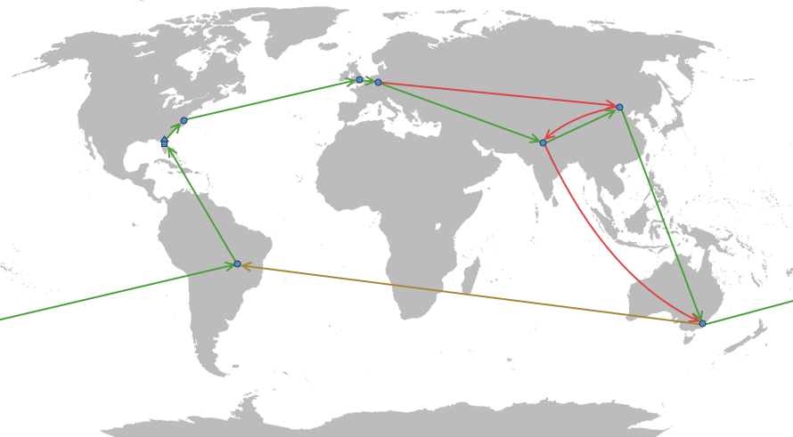
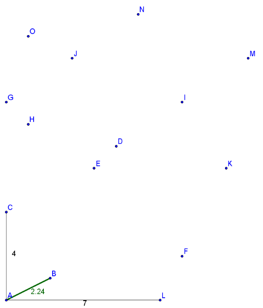
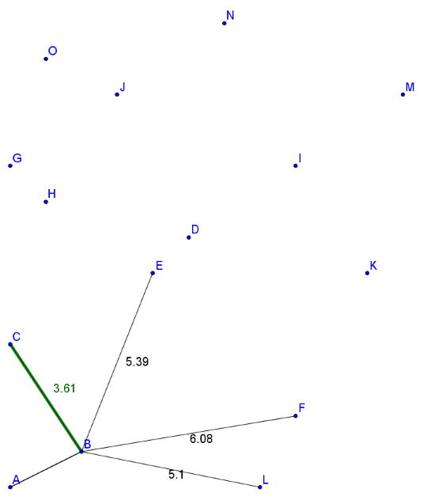
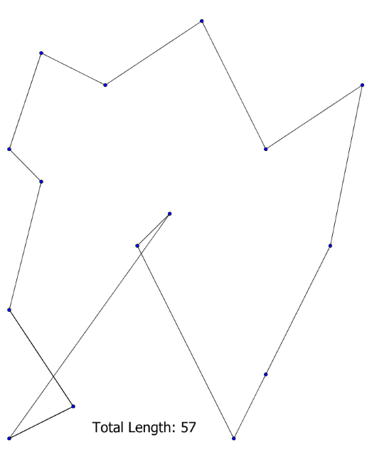
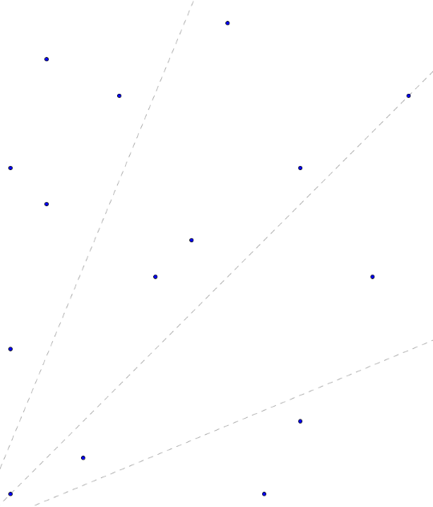
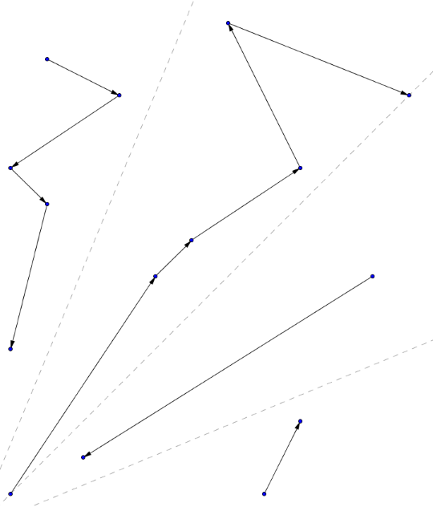
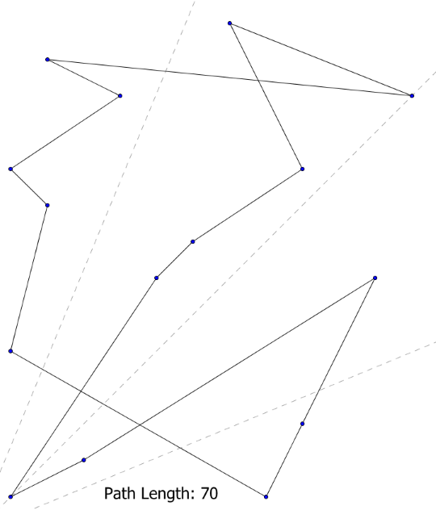
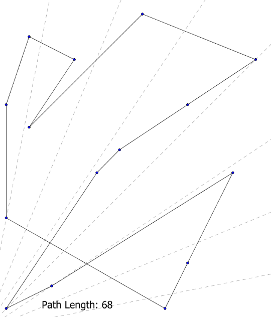
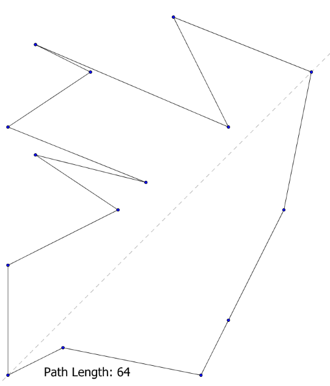
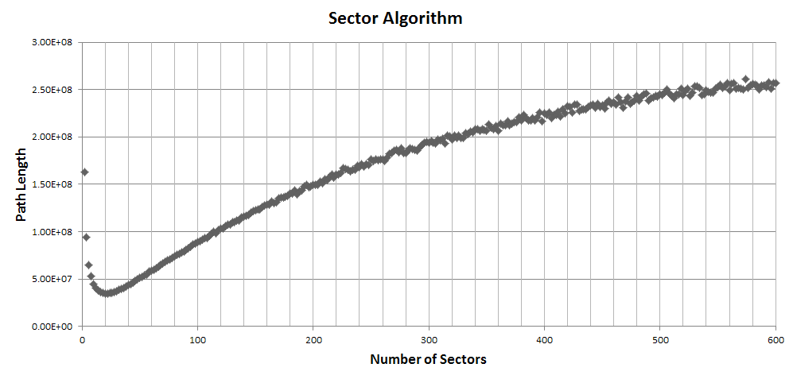

Lately, I have been dedicating much of my time to a project for a university class. Now that some of the load has lightened, I thought it would be a good time to post a reflection for one of the earlier projects we had in the class: Solve the Traveling Salesman Problem.

## The Problem

The Traveling Salesman Problem is easy to describe, but not so easy to actually solve. Imagine for a moment that you are a salesman, and you are embarking on a business trip that involves giving presentations at 7 international cities. However, you also happen to be a very thrifty salesman, and you want to travel the smallest possible distance needed to visit each city exactly once and return to your hometown. What is the order in which you visit the cities?

The diagram below shows an example of the choices you have.

<figure>
	
		
	</img-zoom>
	<figcaption>Different alternative paths are drawn from city to city.</figcaption>
</figure>

The green path shows what I believe is the shortest path between the cities, but it is not so obvious. For instance, is it quicker to take the red path, visiting China before India? Once in Australia, do we travel across the Pacific Ocean or Atlantic to get to Brazil? If you had to visit 700 cities rather than 7, what would you do?

Interestingly, there is currently no efficient program capable of solving this problem. Yes, a program can find the shortest possible path, but it can only do so by effectively checking all or most of the possible combinations, and when you have 700 cities, that's a ridiculously large number of paths (over 1000 digits long!).

For the class, our program only needed to find any short path given a number of unknown cities. So, the path did not need to be the _shortest_ one, but short paths found in a very short amount of time would score better. So, if we were a more knowledgable salesman and realized that trying to find the best path between 700 cities would be impossible, how might we at least approximate a very good path?

## The Greedy Method

The most popular strategy to obtain a short path quickly is to utilize what is known as the greedy method. There is just one rule: always travel to the nearest unvisited city, and repeat. This method is very intuitive, simple to code, and efficient; and, while it may not give the shortest path, it can come pretty close. Most humans when finding a path for the Traveling Salesman problem will actually use a variation of the greedy method with an additional level of planning.

	<figure>
		
			
		</img-zoom>
		<figcaption>Starting at A, find the shortest distance to the next point and travel to that point.</figcaption>
	</figure>
	<figure>
		
			
		</img-zoom>
		<figcaption>Then, do it again, and keep doing that.</figcaption>
	</figure>
	<figure>
		
			
		</img-zoom>
		<figcaption>A path generated by this algorithm.</figcaption>
	</figure>

## My Method

Being who I am though, I enjoy indulging unpopular, unorthodox solutions to problems, and so I decided against using the nice, greedy algorithm. Instead, I focused heavily on my program's speed thinking that a fast enough program could possibly score better than programs returning shorter paths.

Therefore, I implemented a heuristic that may or may not have ever been used before. The idea was this:

1. Divide the coordinate plane into an even number of radial sectors.
2. Calculate the distance of each point to the Origin (coordinate (0,0)).
3. In odd-numbered sectors, sort the points by their distance in _ascending order_.
4. In even-numbered sectors, sort the points in _descending order_.
5. Merge all of the lists. This list makes a path.

This turns out to be extremely easy to code (perhaps even easier than the greedy method), and it runs very quickly. The idea is similar to running up and down the aisles of a grocery store, going back and forth until each aisle is thoroughly scanned. The below images demonstrate how it works:

	<figure>
		
			
		</img-zoom>
		<figcaption>Divide the field into sectors.</figcaption>
	</figure>
	<figure>
		
			
		</img-zoom>
		<figcaption>Sort the points in each sector.</figcaption>
	</figure>
	<figure>
		
			
		</img-zoom>
		<figcaption>Connect each sector.</figcaption>
	</figure>

## Analysis

A question remains, though. Into how many sectors do I divide the points? The example above uses 4 sectors, but I could easily have chosen 2, 6, 8, or even 200 sectors! Below, I used 8 sectors and 2 sectors, and interestingly, both return shorter paths.

	<figure>
		
			
		</img-zoom>
		<figcaption>Divide the field into sectors.</figcaption>
	</figure>
	<figure>
		
			
		</img-zoom>
		<figcaption>Slightly better than eight sectors.</figcaption>
	</figure>

Therefore, the number of divisions matters, and the best number of sectors depends on both the number of cities and how they are distributed. This fact alone was warning enough for me to realize that my particular algorithm was a terrible way of solving this problem, but my mathematical mind was too curious to give up finding out the optimal number of divisions given a set of cities.

Hence an onslaught of experiments ensued. What I would do is graph path length versus number of sectors for various data sets. For evenly distributed cities, I would end up with graphs like the below:

<figure>
	
		
	</img-zoom>
</figure>

The dip at the beginning represents the best number of divisions for the provided set of cities. For this set, optimal is around 22 sectors, and its path length is significantly better than most of the other sector numbers. For other city sets, as the number of cities decreased, the optimal number of sectors also decreased, and vice versa. Furthermore, the _average location_ and _standard deviation_ of the cities mattered as well.

After graphing over 30 sets, I was able to come up with rules for finding the number of sectors to use with about 60% accuracy, but unfortunately, the act of calculating that number nearly doubled the time it took the program to run! In the end, I decided that I could not afford to make the operation any more expensive than it was, so I instead reduced the calculation to a single equation that would guess the number of sectors to use, and I was happy if it at least landed around where the dip was located.

## Reflection

Even after all the analysis and refinement, the algorithm overall performed worse than the greedy counterparts, running maybe slightly faster, but not fast enough to compensate for the worse path lengths. In hindsight, a radial division as shown above was a poor design decision; as cities got farther from the origin, the width of the sectors would increase, and therefore finding the number of appropriate divisions could never be reliable. Instead, dividing the points into _lanes_ would have worked better, as the width of lanes does not change with distance.

Regardless, I enjoyed the mental gymnastics of running statistical experiments on a piece of code. I did not expect for my code to produce such a consistent and beautiful graph, and so when I saw it for the first time, I just had to find out why it worked that way. In front of me was the visual relationship between computer science and mathematics!

Overall, the problem turned out to be more fun than I anticipated, and though the work was long, it was mostly work I put upon myself and enjoyed doing. Making discoveries and finding connections always excites me, for such are the hallmarks of creativity. If you are a programmer reading this, be sure to make a comment explaining how you would have solved this problem!

## References

* [World Map](http://www.u-tt.com/worldmap_Projects.html) (modified)
* Diagrams generated using Geogebra
* Graph generated using Microsoft Excel
