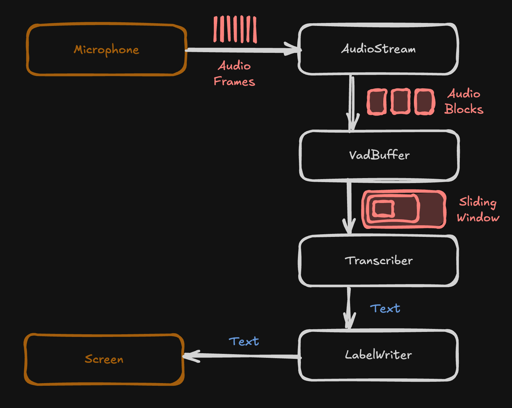

I just spent a couple hours writing a tiny desktop application which listens to what you say and then prints it to the screen as text, live subtitles basically. I figured I'd document the dev work here; the project was a pretty nice atomic way to explore threading, streams, and AI usage in python.

If you're learning python, this might be a useful example to learn from.

> [!NOTE]
> I'm very proficient in javascript, less so in Python. This project was a great excuse to keep my Python knowledge sharp. If something can be improved, please tell me in the comments section!

## The Problem

Time yourself saying the following out loud:

> The quick brown fox jumped over the lazy dog.

Takes about three and a half seconds for me.

**That's too slow. WAY too slow.** It absolutely cannot take over three seconds between when something is said and when words appear on screen. Captions should appear on the screen as you say each word, live.

To accomplish that, we don't process audio in big chunks like this. I mean, we still process in chunks, but the chunks are _tiny_, and when you string enough tiny chunks together, you get an **audio stream**.

The challenge, then, is to take a stream of audio and process it into text in such a way that it is 1) fast, and 2) accurate.


## The Audio Pipeline

My goal was to make the code _look like_ an actual pipeline of individual responsibilities.

```
AudioStream()
  .pipe(VadBuffer())
  .pipe(Transcription())
  .pipe(LabelWriter())
```

Each component has a [single responsibility](https://en.wikipedia.org/wiki/Single-responsibility_principle):

* **AudioStream**: Get the device audio and start streaming frames.
* **VadBuffer**: Buffer the frames into increasingly larger chunks depending on how long the user is speaking.
* **Transcription**: Take a giant audio chunk and turn it into text.
* **LabelWriter**: Write the text to the screen.

No architecture is complete without a diagram!

<figure class="h-20">
  
    
  </img-zoom>
  <figcaption>Data flows through each module.</figcaption>
</figure>

### Base Pipe Class

The `Pipe` class I wrote is really just a kind of semantic [Observer Pattern](https://refactoring.guru/design-patterns/observer). The `pipe` function represents the idea that data from this thing goes to the next thing, but what it's really doing is registering a **subscriber** to the component that acts whenever the component sends data.

It's just pub-sub wrapped in PVC piping.

```python
TIn = TypeVar("TIn")
TOut = TypeVar("TOut")

class Pipe(Generic[TIn, TOut]):
	def __init__(self):
		self._pipes: list[Pipe[TOut, Any]] = []

	# Subscribe to the data stream
	def pipe(self, receiver: "Pipe[TOut, Any]"):
		self._pipes.append(receiver)
		return receiver
	
	# Publish: this triggers all of the subscribers
	def send(self, data: TOut):
		threads = [threading.Thread(target=r.receive, args=(data,)) for r in self._pipes]
		# The multithreading is so subscribers can act concurrently
		for t in threads:
			t.start()

	# Meant to be overwritten; this responds to incoming data
	def receive(self, data: TIn):
		pass
```

### Getting Audio

The `sounddevice` package allows you to get the raw audio off of a device on the person's computer. It captures multiple **frames** into **blocks** and sends each block to the rest of the pipeline.

* **Frame**: A single value representing the intensity of the sound wave at that instant.
* **Block**: A set of frames over a small period of time. In my case, I am sending about 30ms of audio at a time from the device to the rest of the pipeline.

```python
import sounddevice as sd

# This means each frame represents 62.5 microseconds of audio
SAMPLE_RATE = 16000
# This is how many frames are captured at once, ~30ms
BLOCKSIZE = 512

class AudioStream(Pipe[None, np.ndarray]):
	_audio = queue.Queue()

	def start(self):
		# We keep listening to audio on a background thread so we can do other stuff
		self._thread = threading.Thread(target=self._process_audio_queue, daemon=True)
		self._thread.start()

	def _process_audio_queue(self):
		# This is the start of the stream
		with sd.InputStream(channels=1, samplerate=SAMPLE_RATE, blocksize=BLOCKSIZE, callback=self._read_audio_into_queue):
			while True:
				audio = self._audio.get()
				# This sends the audio to the rest of the pipeline
				self.send(audio)

	# The point of the queue is to interface with how sd.InputStream works
	def _read_audio_into_queue(self, indata, frames, time, status):
		self._audio.put(indata.copy())
```

### Buffering a Sliding Window

It is not enough to simply stream each tiny chunk of audio to the speech transcription stage, for two reasons.

The first problem is obvious: A 30ms chunk of audio almost certainly represents less than a word. We need longer audio chunks to actually hear words. The solution to that is to **buffer** the audio. A buffer simply collects audio into a larger chunk that the transcription layer can more easily interpret, anywhere from half a second to a second in length.

But there's a second, more subtle problem: speech interpretation is contextual. "Play" and "Flay" can sound very similar based on accent and whatnot. Thankfully, our brains are very good at knowing which was meant even if we misheard the syllables (nobody says "I'm going to flay a board game").

Consider text that was chunked in this way:

* I'm going
* to play
* a board
* game

If you give a transcription module each chunk completely independently, there's a decent chance it mishears things, such as writing "flay" instead of "play". However, if you give it the entire sentence all at once, it's much more likely to get it right, due to having contextual info.

But we still want to write text to the screen as it's spoken, rather than wait for the entire sentence. So, we implement a **sliding window**: for as long as words are being spoken, give the transcription step more and more of the sentence:

* I'm going
* I'm going to play
* I'm going to play a board
* I'm going to play a board game.

It's possible some of the early transcriptions are wrong, but it will correct itself as more of the sentence is spoken.

We use <abbr>VAD</abbr> ("Voice Activation Detection") to detect when the sentence is finished. In my case, I am using [Silero VAD](https://github.com/snakers4/silero-vad), which is a neural network trained to detect human voice in audio clips as small as 32ms.

```python
from silero_vad import VADIterator

CHUNK_SECONDS = 1

class VadBuffer(Pipe[np.ndarray, np.ndarray]):
	def __init__(self):
		super().__init__()
		# VADIterator is used for streaming
		torch.hub.set_dir(model_location("silero"))
		model, _ = torch.hub.load(repo_or_dir="snakers4/silero-vad", model="silero_vad", trust_repo=True)
		self._vad = VADIterator(model=model, sampling_rate=SAMPLE_RATE, min_silence_duration_ms=CHUNK_SECONDS * 1000)

		self._hot = False

		# Two buffers: one for accumulating 1 sec of audio
		# The other for accumulating the sentence over time
		self._chunk_buffer = np.array([], dtype=np.float32)
		self._phrase_buffer = np.array([], dtype=np.float32)

	def receive(self, data):
		as_tensor = torch.from_numpy(data.flatten())

		# VAD is a neural network that knows when speech starts/stops
		speech_dict = self._vad(as_tensor, return_seconds=True)
		start_detected = speech_dict and speech_dict.get("start")
		end_detected = speech_dict and speech_dict.get("end")
		
		if start_detected:
			self._hot = True
		elif end_detected:
			self._hot = False

		if self._hot or end_detected:
			self._chunk_buffer = np.concatenate([self._chunk_buffer, data.flatten()])
			self._phrase_buffer = np.concatenate([self._phrase_buffer, data.flatten()])

			# Ask for a transcription every second, or when audio ends
			if end_detected or len(self._chunk_buffer) > SAMPLE_RATE * CHUNK_SECONDS:
				self._send_current_phrase()

	def _send_current_phrase(self):
		# The actual send to the next bit of the pipeline
		self.send(self._phrase_buffer)
		self._chunk_buffer = np.array([], dtype=np.float32)
		if not self._hot:
			self._phrase_buffer = np.array([], dtype=np.float32)
```

### Speech to Text

Trying to write an algorithm to convert audio to text is extremely hard. Which is why you should never do it yourself!

I used [Faster Whisper](https://github.com/SYSTRAN/faster-whisper), a reimplementation of a model by OpenAI that's trained to transcribe spoken audio.

```python
from faster_whisper import WhisperModel

class Transcription(Pipe[np.ndarray, str]):
	def __init__(self):
		super().__init__()
		self._model = WhisperModel("base", device="cpu", download_root=model_location("whisper"))
	
	def receive(self, data):
		segments, _ = self._model.transcribe(data, condition_on_previous_text=False)
		text = " ".join(s.text for s in segments)
		self.send(text)
```

## The Rest of the Code

The app is called **[Say It Write It](https://github.com/Auroratide/Say-It-Write-It)**, and all the code is open sourced, including the tiny amount of code devoted to actually writing to a window.

Feel free to study from it, or tell me what I could do better!