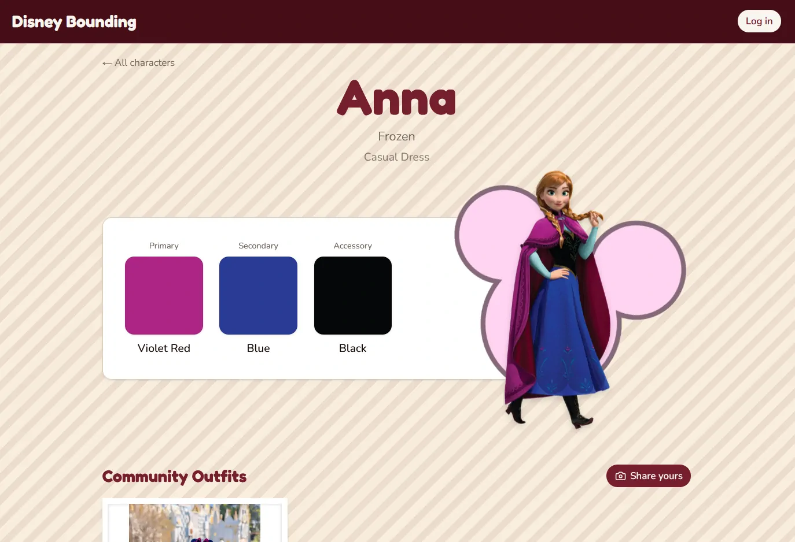

<style>
	.takeaway p {
		margin-block: 0 1em;
		margin-inline-start: 1.25em;
	} .takeaway p:first-child {
		margin-block: 1.75em 0.75em;
		margin-inline: 0;
	}
</style>

First, an oversimplified defintion of **lead developer**: Someone who throws a bunch of code at a problem until it goes away, and they've been doing that long enough to have... seen things.

And also an oversimplified definition of **vibe coding**: Telling the AI in 20 different ways what the problem is until it shuffles enough code to solve it.

So, I wanted to try an experiment: **How far can I get letting AI code 95% of something that I know how to code myself?**

And the answer is: **very far**, but with a lot of oversight. To put it succinctly:

<major-point>

AI wrote almost all the code, but I managed almost all the quality.

</major-point>

I've made [many websites](/portfolio), and I know how to make them _well_. Which in programming terms, means making them accessible, tested, flexible, secure, responsive, clean, readable, and many other things. So, my goal is to assess AI's output on all of the factors I know are important, in order to understand **1)** where AI is limited, and **2)** what tips make vibe coding more effective.


## My Two "Laws" of Vibe Coding

If you are a developer looking to utilize AI in the best way, here's **Law #1**:

<major-point>

Use AI to automate your fingers, not your brain.

</major-point>

Or in other words, let AI write code. It's very good and very fast. Even let it inform your decisions.

But don't let it _make_ those decisions. Own what you're building, care about its quality, and make it something you can be proud of. AI may shorten the time it takes to build, but all good things still take time.

And, **Law #2**:

<major-point>

Don't let AI code more than you can verify.

</major-point>

It's very tempting to let AI go wild and implement everything, or refactor the whole codebase. But don't.

Code one feature at a time, refactor one concept at a time. These were good tips pre-AI, and they're good tips now. Especially since (in my experience) AI has the most difficulty in verifying its own work, we are in charge of double checking things were built the right way. And it's easier to be thorough for smaller changes than for larger ones.

> [!CAUTION]
> And I don't mean verify _code_. I mean verify _output_.
> 
> I mean, it's good to review the code too, at least right now. That said, I'm fairly confident we're heading toward a future where it will be more worthwhile to review AI's output in ways other than staring at its code.


## My Personal Takeaways

> [!TIP]
> This is **NOT** a guide on how to best vibe code. It's simply a list of lessons I learned that discern hype from reality, at least in my experience.

<div class="takeaway">

**If AI was _human_, it would be fun to work with.**

AI is an impressive developer. It is senior-level at many things, and simultaneously junior at many others. Most importantly, AI is competent enough to bounce ideas off of. I can give it three loose ideas I have for implementation, and it will break them down. This is exactly why I pair program with people: two brains are better than one.

But it is _not_ a person. AI doesn't make jokes, have a life beyond code, cares about its craft, such and such. So while I am super productive using it, it isn't as _fun_.

</div>

<div class="takeaway">

**Technical understanding confers a notable advantage, but is not strictly necessary anymore.**

The bigger the project, the more technical knowledge matters. During my experiment, I tried being very high level. "Here Claude. Make this UI sketch real."

And it works. But it starts to work less once you have to implement authentication, databases, multitenancy, and more. I now genuinely believe that AI can help non-technical folks create personal tools. But if you want to make something broader use? Take the time, hit the books.

> [!WARNING]
> Expertise is important... **for now**. When it comes to AI, its growth is so impressive that we cannot just consider its current state, but its future state too. After all, even today some claim success with [zero hand-written code, zero code review](https://factory.strongdm.ai/techniques).

</div>

<div class="takeaway">

**AI is good at breaking down big tasks into small tasks. Let it do so.**

I was impressed by AI's ability break down a broad idea like "make accounts and login happen" into an 8-step coherent plan of atomic steps. It even interviewed me during planning for specific requirements. In the industry we call this "Story Refinement", and it's something I generally expect senior-level developers to be good at.

</div>

<div class="takeaway">

**AI does not inherently develop for unspecified, but important, requirements.**

In the industry, we call these Cross-Functional Requirements (<abbr>CFRs</abbr>). They are things we _assume_ are important without having to say them out loud. For example, accessibility is important for websites. We want everyone, including those with disabilities, to use our sites. Other CFRs include observability (for support), responsiveness (mobile-friendly), performance (speed), and security.

Sometimes, if you want something to adapt to screen size, you have to tell the AI to account for this. Most agentic systems allow you to define **Skills**, letting you to bypass the repetitiveness of redefining CFRs all the time by consolidating them into a single reference the AI uses on every request.

</div>

<div class="takeaway">

**AI needs the most help with verification and testing for correctness.**

By default, AI does not have eyes or ears, nor does it have a perfect understanding of what you actually want. So, either you have to do an extra-thorough job verifying the correctness of what the AI built, or you have to give AI capabilities it needs to verify things itself. I integrated Claude Code with [agent-browser](https://github.com/vercel-labs/agent-browser) to give it the ability to navigate and look at web pages autonomously, and this considerably improved its design development.

</div>

<div class="takeaway">

**I needed to steer AI into writing good tests.**

By default, AI often either neglect writing automated tests, or will write tests that are bad. Automated tests are written and executed repeatedly to ensure old features continue to work with new changes. A codebase without tests is a disaster waiting to happen; any change to the code could be the change that breaks everything.

Does AI need to write tests? I'd argue so, especially when AI lacks the ability to verify apps fully end-to-end. Unit tests _are_ the way AI can verify app behaviour, and so it should write them. When vibe coding, either use a **skill** to enforce tests are written, or code review explicitly for good testing.

</div>

<div class="takeaway">

**AI is trained on _most common practices_, not _best practices_.**

While reviewing outputted code, I often found myself having to tell the AI how to write accessible code. That's because most code in general wasn't written with best accessibility practices in mind. It's important to remember that AI mimics what's common, not always what's best (at least, best from a human perspective).

</div>

## What I (or... AI?) Built

I guess... _we_ built a website for a mom! She likes dressing in the same colors as Disney Characters; it's a hobby called **Disney Bounding**. So I made a catalog for people to share their outfits and get color guidance!

<figure class="h-15">
  
    
  </img-zoom>
  <figcaption>Each Disney character suggests clothing colors to find, and a place to upload images.</figcaption>
</figure>

If you want, you can check it out at **[disneybounding.com](https://disneybounding.com)**!


## What now?

The two biggest gaps I identified with Claude were:

* Subtly dropping quality in favor of getting things done
* Difficulty verifying its own work

So my next goal is to learn how to use AI to cover these gaps. I suspect leveraging existing Skills (such as [Superpowers](https://github.com/obra/superpowers)) or making my own can solve the first issue. And for the second issue, I have ideas of _paradigms_ that could help, but I gotta keep experimenting!

-------------

## Addendum: Specific Examples

These are notable interactions from my experiment. You can think of these things as a kind of "evidence" for the takeaways I made earlier.

### An Example Plan

Since my website has users uploading images of themselves, it is imperative they be able to delete these images. Therefore, accounts are necessary.

Accounts are not simple, so I asked AI to draft a detailed plan. My impression:

* The finite steps helped Claude make 8 small commits rather than one giant commit.
* The plan follows a logical progression: set up the backend for auth, then make the frontend use it, then make features require auth.
* Each step considered the testing strategy at that step.
* One criticism is the AI did not think about code reusability. It did exactly what was required to make the feature work, and nothing more.
* It's interesting to see code snippets in the plan. I rarely have actual code snippets in my plans because it feels too inflexible, though perhaps for an AI this is fine.

I've pasted the entire plan here. It wasn't a perfect plan, but I've yet to see any developer make a perfect plan (_definitely_ myself included).

<details>
<summary>Claude Code's Account Plan</summary>

``````
# Accounts Plan — Disney Bounding

## Context

Community outfit uploads are currently anonymous. Users can submit photos but have no ownership of them — only admins can delete records. The goal is to add a lightweight account system (email OTP, no passwords) so that:

1. Upload requires an account
2. Users can delete their own uploaded images
3. Users can log out
4. Users can edit basic profile info (display name, profile picture)

The design prioritizes minimal friction: login happens in a modal (no page navigation), and a thin site-wide header is added to expose the account button everywhere.

---

## Decisions

- **OTP delivery**: Email via PocketBase's built-in OTP, caught locally by Mailpit
- **Login UI**: Modal (no separate `/login` page)
- **Header**: Minimal site-wide header added to root layout
- **Legacy records**: Orphaned (pre-accounts) records stay visible; only admin can delete them
- **`CommunityOutfitGrid`**: Stays a server component; receives `currentUserId` as prop; only `DeleteOutfitButton` is a client leaf
- **PocketBase enforces ownership**: `deleteRule: "@request.auth.id != '' && user = @request.auth.id"` — API route passes the authenticated PocketBase client; the rule does the real guard

---

## Step 1 — PocketBase: Enable OTP, Add User Relation

**New files:**
- `pocketbase/migrations/003_enable_otp_auth.js` — Enable OTP on the built-in `users` auth collection; disable password auth
- `pocketbase/migrations/004_add_user_to_community_outfits.js` — Add optional `user` relation field to `community_outfits`; update `createRule` and `deleteRule`

**Migration 003** modifies the `users` collection (type: `auth`). The PocketBase JS migration API for auth collections uses `collection.authRule`, `collection.otp`, and `collection.passwordAuth` properties. Verify exact field names against PocketBase v0.24 docs before writing — the admin UI JSON export is a reliable reference.

**Migration 004** changes:
- Add `RelationField` named `user` pointing at `users`, `required: false`, `maxSelect: 1`
- `createRule`: `"@request.auth.id != ''"`  ← authenticated users only
- `deleteRule`: `"@request.auth.id != '' && user = @request.auth.id"` ← owner only

**Note:** Tightening `createRule` will break existing tests (they submit without auth). This step and Step 5b (auth in POST route) should be done together so tests are updated at the same time.

**Verification:** Restart Docker (`pnpm services:stop && pnpm services:start`), open PocketBase admin UI at `localhost:8090/_/`, confirm the users collection shows OTP enabled and community_outfits shows the new `user` relation field and updated rules.

---

## Step 2 — Local Email: Add Mailpit to Docker Compose

**Modified files:**
- `docker-compose.yml` — Add `mailpit` service
- `pocketbase/migrations/005_configure_smtp.js` — Configure PocketBase SMTP settings to point at Mailpit

**docker-compose addition:**
```yaml
mailpit:
  image: axllent/mailpit:latest
  ports:
    - "8025:8025"   # Web UI for reading captured emails
    - "1025:1025"   # SMTP
```

**Migration 005** uses `app.settings()` to set SMTP host/port. Use env vars so production can override:
```js
const s = app.settings();
s.smtp.enabled = true;
s.smtp.host = process.env.PB_SMTP_HOST || "mailpit";
s.smtp.port = parseInt(process.env.PB_SMTP_PORT || "1025");
s.smtp.senderAddress = process.env.PB_SMTP_SENDER || "noreply@disneybounding.local";
app.save(s);
```

**Verification:** Trigger an OTP request via the PocketBase API or admin UI; the email should appear at `localhost:8025`.

---

## Step 3 — Auth Infrastructure

**Modified files:**
- `lib/pocketbase.ts` — In the client singleton branch, call `clientInstance.authStore.onChange(...)` to mirror auth state into a cookie (`pb_auth`) on every change. This makes the token available to server components.

**New files:**
- `lib/auth.ts` — Server-side helper:
  ```ts
  export async function getServerAuth() {
    const cookieStore = await cookies();   // from "next/headers"
    const pb = getPocketbase();            // fresh server instance
    const raw = cookieStore.get("pb_auth")?.value;
    if (raw) pb.authStore.loadFromCookie(`pb_auth=${raw}`);
    return { pb, user: pb.authStore.isValid ? pb.authStore.record : null };
  }
  ```
- `app/components/AuthProvider/AuthProvider.tsx` — `"use client"` context; hydrates from `getPocketbase().authStore` on mount. Exposes:
  ```ts
  interface AuthContext {
    user: RecordModel | null;
    requestOtp: (email: string) => Promise<{ otpId: string }>;
    confirmOtp: (otpId: string, code: string) => Promise<void>;
    logout: () => void;
  }
  ```
  `logout` calls `pb.authStore.clear()` and clears the cookie.

**Test:** `lib/auth.test.ts` (Node project) — test that `getServerAuth()` returns `{ user: null }` when no cookie; returns a valid user record when given a valid auth cookie (use the admin PocketBase client to create a test user and obtain a token).

---

## Step 4 — Login Modal + Site Header

**New files:**
- `app/components/LoginModal/LoginModal.tsx` — `"use client"`. Two-step flow:
  1. Email input + "Send code" → calls `requestOtp(email)` from `useAuth()`
  2. OTP input + "Verify" → calls `confirmOtp(otpId, code)` from `useAuth()`
  - On success, modal closes (parent controls `isOpen` state)
  - Error states: invalid/expired OTP, rate limit
- `app/components/SiteHeader/SiteHeader.tsx` — `"use client"`. Reads `useAuth()`:
  - Not authenticated: shows "Log in" button that opens `LoginModal`
  - Authenticated: shows user avatar/name + dropdown (link to `/account`, "Log out" button)

**Modified files:**
- `app/layout.tsx` — Wrap body children in `<AuthProvider>`, add `<SiteHeader />` above `{children}`

**Test:** `app/components/LoginModal/LoginModal.test.tsx` (Browser project). Mock `useAuth()` hook. Test: renders email input, transitions to OTP step after mock `requestOtp`, calls `confirmOtp` with correct values, shows error on failure.

---

## Step 5 — Auth-Gate Uploads + Delete API Route

**5a. Modified: `app/api/community-outfits/route.ts` (POST)**

Read the `Cookie` header from the `NextRequest`. Load auth into the PocketBase server instance. Return 401 if not authenticated. Append `user: pb.authStore.record!.id` to the FormData sent to PocketBase.

**5b. New: `app/api/community-outfits/[id]/route.ts` (DELETE)**

```ts
export async function DELETE(request, { params }) {
  const { id } = await params;
  const pb = getPocketbase();
  pb.authStore.loadFromCookie(request.headers.get("cookie") ?? "");
  if (!pb.authStore.isValid) return NextResponse.json({ error: "Unauthorized" }, { status: 401 });
  try {
    await pb.collection("community_outfits").delete(id);
    return new NextResponse(null, { status: 204 });
  } catch {
    return NextResponse.json({ error: "Forbidden" }, { status: 403 });
  }
}
```

**Tests:**
- Update `app/api/community-outfits/route.test.ts`: add auth to test setup (create + authenticate a test user; include the auth cookie in requests); add test for 401 when unauthenticated
- New `app/api/community-outfits/[id]/route.test.ts`: test 401 (no auth), 204 + record deleted (owner), 403 (authenticated as a different user)

---

## Step 6 — Delete Buttons in the Grid

**Modified files:**
- `app/data/community-outfits.ts` — Add `userId: string | null` to `CommunityOutfit` type and `CommunityOutfitRecord`. In `getCommunityOutfits()`, expand the `user` relation field and map `record.user` → `userId`.
- `app/data/community-outfits.test.ts` — Add test: `userId` is populated correctly; is `null` for orphaned records.
- `app/characters/[slug]/page.tsx` — Call `getServerAuth()` to get `currentUserId`. Pass it as a prop to `CommunityOutfitGrid`.
- `app/components/CommunityOutfitGrid/CommunityOutfitGrid.tsx` — Accept `currentUserId: string | null` prop. Render `<DeleteOutfitButton>` over images where `outfit.userId === currentUserId`.
- `app/components/CommunityOutfitGrid/CommunityOutfitGrid.test.tsx` — Add tests: no delete buttons when `currentUserId` is null; delete button shown for matching `userId`; not shown for non-matching outfits.

**New files:**
- `app/components/DeleteOutfitButton/DeleteOutfitButton.tsx` — `"use client"`. Trash icon button. On click: calls `DELETE /api/community-outfits/[id]`; on 204, calls an `onDeleted` callback (parent removes the card). On error, shows a brief error state.
- `app/components/DeleteOutfitButton/DeleteOutfitButton.test.tsx` (Browser project) — Mock `fetch`. Test: calls correct route on click, invokes `onDeleted` on success, shows error on failure.

---

## Step 7 — Auth Guard on Upload Form

**Modified files:**
- `app/components/UploadOutfitForm/UploadOutfitForm.tsx` — Use `useAuth()`. If `user` is null, render a "Log in to share your outfit" prompt (with a button that opens the login modal) instead of the form. Remove the "name or handle" text field (submitter name now comes from the user's profile `name`); update the POST handler to omit `submitter_name` from FormData (the API sets `user` server-side; the display name on the grid card can pull from the user relation or the now-removed field — decide at implementation time).
- `app/components/UploadOutfitForm/UploadOutfitForm.test.tsx` — Update tests to reflect the removed name field; add test for the "log in" prompt when unauthenticated.

---

## Step 8 — Profile Page

**New files:**
- `app/account/page.tsx` — Server component. Calls `getServerAuth()`; redirects to home if not authenticated. Renders `EditProfileForm`.
- `app/account/EditProfileForm.tsx` — `"use client"`. Fields: display name (text input), profile picture (file input). On submit, calls `pb.collection("users").update(user.id, formData)`. Updates the `AuthProvider` context after success.

**Verification:** Log in, navigate to `/account`, change name and upload a pfp. Confirm changes appear in the site header.

---

## Step Ordering

| # | Step | Ships independently? |
|---|------|---------------------|
| 1 | PocketBase migrations (003 + 004) + Step 5a/5b POST auth update together | Yes — do migrations and POST auth update as one unit |
| 2 | Mailpit in docker-compose + migration 005 (SMTP) | Yes |
| 3 | Auth infrastructure (`lib/pocketbase.ts` cookie sync, `lib/auth.ts`, `AuthProvider`) | Yes |
| 4 | LoginModal + SiteHeader + layout.tsx | Yes |
| 5 | DELETE route + updated POST route tests | Yes |
| 6 | Delete buttons in the grid (`userId` on `CommunityOutfit`, `DeleteOutfitButton`) | Yes |
| 7 | Auth guard on upload form | Yes |
| 8 | Profile page | Yes |

---

## Critical Files

| File | Role |
|------|------|
| `lib/pocketbase.ts` | Add cookie sync to client singleton |
| `lib/auth.ts` | New — server-side auth helper |
| `app/layout.tsx` | Add `AuthProvider` + `SiteHeader` |
| `app/data/community-outfits.ts` | Add `userId` to type + query |
| `app/characters/[slug]/page.tsx` | Pass `currentUserId` to grid |
| `app/components/CommunityOutfitGrid/CommunityOutfitGrid.tsx` | Render delete buttons |
| `app/api/community-outfits/route.ts` | Add auth enforcement |
| `app/api/community-outfits/[id]/route.ts` | New DELETE handler |
| `pocketbase/migrations/003_enable_otp_auth.js` | Enable OTP on users |
| `pocketbase/migrations/004_add_user_to_community_outfits.js` | User relation + rules |
| `pocketbase/migrations/005_configure_smtp.js` | SMTP → Mailpit |
| `docker-compose.yml` | Add Mailpit service |
``````

</details>


### Setting cookies incorrectly

At some point, Claude got stuck on a 10-minute debugging loop trying to figure out why login was not working. I found the problem after just one minute. What puzzled me was not _that_ Claude got stuck, but the _kind_ of error that stumped it.

Specifically, this code:

```typescript
export function getPocketbase(): PocketBase {
	// The 'client' is the browser
	if (!clientInstance) {
		clientInstance = new PocketBase(url);
		clientInstance.authStore.onChange(() => {
			// Pocketbase creates an 'http-only' cookie. This line is wrong.
			document.cookie = clientInstance!.authStore.exportToCookie({ sameSite: "Lax" });
		});
	}
	return clientInstance;
}
```

Claude spent 10 minutes trying different hacks to set an HTTP-only cookie on the browser. Which is neither possible nor sensible. HTTP-only cookies are given by the _server_ specifically to keep its contents from being directly accessible. It keeps the user's session more secure.

Of course, once I told Claude this, it figured out what to do. But you'd hope that a system capable of mass producing theoretically shippable code would innately know some basic security concepts.

See: [Using HTTP Cookies](https://developer.mozilla.org/en-US/docs/Web/HTTP/Guides/Cookies)


### Not using dialogs for modals

Claude kept insisting on re-implementing its own modal (popup box), probably because there are a kajillion examples of code that does exactly that. But it's completely unnecessary, since browsers simply have native support for [dialogs](https://developer.mozilla.org/en-US/docs/Web/HTML/Reference/Elements/dialog), since 2022.

This is a problem because [modals aren't easy to implement accessibly](https://www.w3.org/WAI/ARIA/apg/patterns/dialog-modal/). And people have coded them wrong for years. Whereas, the HTML dialog element handles most of the complexity for you.

The key point is: **AI does not write accessible code**, not without some help.

> [!NOTE]
> Concretely, Claude was not implementing "tab-trapping". Some users don't use a mouse, and instead use the Tab key to move from button to button. A modal is a popup, sitting on top of the web page. If you don't trap the tab, then it's possible for the user to tab into buttons _under_ the modal, which can be confusing.

### Overmocking in tests

[I once wrote something profound](/posts/nicely-testing-react-components):

> Test what your [code] does, not how it works.

We want to test _outcomes_. Unfortunately, I had trouble with Claude insisting on using **mocks** to test _implementation_ instead.

Mocks are much too big a topic to cover here (see [Mocks aren't stubs](https://martinfowler.com/articles/mocksArentStubs.html)), but all you need to know is that mocks tend to make tests either brittle or optimistic.

* Mocks make tests **brittle** by asserting the details of implementation. It's possible to change how a function works under the hood without changing its overall outcome. Ideally, tests pass regardless of the underlying mechanism.
* Mocks make tests **optimistic** by assuming something is true about the components being mocked. If it turns out you mocked _incorrectly_, then the test could pass while the same code in production fails.

That said, mocks are useful, which is why Claude loves them. Here's an example from the codebase:

```typescript
beforeEach(() => {
	// useAuth is a React hook to get auth info.
	// Claude stubs it because it's not easy to simulate authentication.
	vi.mocked(useAuth).mockReturnValue({
		user: { id: "user1", email: "test@example.com" },
	});
});

it("does not show a delete button for outfits owned by a different user", () => {
	// This test is simple because of the auth stub.
	// The outfit belongs to a different user.
	render(
		<CommunityOutfitsSection
			{...defaultProps}
			outfits={[outfit({ id: "1", userId: "user2" })]}
			currentUserId="user1"
		/>
	);

	expect(screen.queryByRole("button", { name: /delete outfit/i })).toBeNull();
});
```

In my opinion, the only reason this mock is valuable is because the auth provider was not coded with testing best practices. The mock works and helps make the test simpler, but is less robust overall.

<major-point>

Scrutinize AI-written tests. Even if you don't review code, _please_ review the tests.

</major-point>


### Broad knowledge of technologies

Pocketbase and Mailpit are key components of the codebase, but I did not know of either of them before this. I simply asked Claude to give me options for "tiny server with auth" and "a way to fake an email inbox for one-time passwords".

Meaning, AI is pretty useful for tool-discovery. It's even more useful when you can articulate what you need.

In general, I personally believe every codebase should be runnable completely locally. Claude can be told this principle, and can generate a nice docker compose file, like the one below for all the external services I used. Very useful, as for the life of me I've never been able to memorize all the fields docker needs.

```yaml
services:
  pocketbase:
    build:
      context: .
      dockerfile: pocketbase/Dockerfile
    ports:
      - "${PB_PORT:-8090}:8090"
    volumes:
      - pocketbase_data:/pb/pb_data
      - ./pocketbase/migrations:/pb/pb_migrations:ro
    env_file:
      - path: ./pocketbase/.env.local
        required: false
    environment:
      PB_ORIGINS: ${PB_ORIGINS:-http://localhost:3000}
    restart: unless-stopped
    healthcheck:
      test: ["CMD", "wget", "-qO-", "http://localhost:8090/api/health"]
      interval: 10s
      timeout: 5s
      retries: 5
    depends_on:
      - mailpit

  mailpit:
    image: axllent/mailpit:latest
    ports:
      - "8025:8025"   # Web UI — browse captured emails at localhost:8025
      - "1025:1025"   # SMTP — PocketBase sends OTP emails here

volumes:
  pocketbase_data:
```
