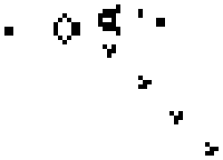

Last week, I started probing the topic of AI creativity by testing how well it could [invent a novel type of puzzle](/posts/can-ai-invent-a-puzzle). Before I go deeper down the rabbit hole, perhaps I should take a bird's eye view of the topic and propose why this is relevant to even question amongst all the other extremely important AI topics.

1. **Safety**: Much of our recent technological progress is the result of **applied novelty**, people solving problems in new ways or asking questions no one thought to ask. The automation of applied novelty would make the future of technology hard to predict yet be extremely impactful on the future of humanity.
2. **Cognition**: I posit that creativity _may be_ a demonstration of the emergence of understanding, which is of interest to people curious about the potential for artificial sapience or sentience.

> [!NOTE]
> I'm currently in the middle of researching ways people have already been evaluating creativity in AI! So for this week I'm posting a mostly theoretical thought while I continue to sort through my research.

## Emergence

You are made of billions of tiny individual cells. And cells live really simple lives: they perform a small unique function for your body, they split, and they die. Crucially, not a single cell in your body "thinks". None of them contemplate what it's going to have for dinner, and none of them cry because of something they read.

But for some reason, _you do_.

This is the concept of **emergence**: individual entities may operate under very simple rules, yet when they act together, it produces complex behaviour greater than the sum of the parts.

Emergence pops up everywhere:

- Ants finding the most efficient paths to food despite mostly wandering around.
- Birds flocking together despite only knowing what their neighbors are doing.
- Snowflakes creating unique and detailed shapes despite following simple physical laws.

### Hard to predict

Pretend there's a square grid in front of you, where each square can be alive or dead. And I give you the following ruleset:

1. An alive square dies if it has less than two alive neighbors or more than three alive neighbors.
2. A dead square comes alive if it has exactly three alive neighbors.
3. Repeat steps 1 and 2 forever.

This tiny exceedingly simple ruleset generates complex patterns: gliders that move across the screen, machines that _generate_ gliders, machines that generate glider generators, and even machines that emulate the ruleset recusively.

<figure class="h-15">
	
		
	</img-zoom>
	<figcaption>This is called a Glider Gun.</figcaption>
</figure>

This ruleset is [Conway's Game of Life](https://en.wikipedia.org/wiki/Conway%27s_Game_of_Life). It's elegant in how it represents the purest way complexity can _emerge_ from simple rules.

But how? How do you predict the existence of glider generators from this ruleset?

Or if I give you an arbitrary grid of alive and dead cells, how do you predict whether it devolves into chaos or gives rise to some kind of useful structure?

The point is this: **emergent behavior is hard to predict**.

### AI

At the end of the day, AI systems (which include LLMs plus all the harnesses built around them) are billions of numbers following a set of rules. For some reason, these numbers can write code, and it can write code for problems it has never seen before.

There is active debate on whether what we're witnessing is the _emergence_ of intelligence beyond regurgitation of everything humanity has written.

That is, is AI merely _finding solutions_, or is it genuinely _solving problems_?

- On the one hand, AI has been shown to develop a sort of mental model (<q>internal representation</q>) for the game Othello despite never even being told the rules ([Emergent World Representations: Exploring a Sequence Model Trained on a Synthetic Task](https://arxiv.org/html/2210.13382v5) by Kenneth Li and collaborators).
- On the other hand, researchers have shown that claims of emergent behavior disappear when benchmarks are measured in a different way, indicating statistical bias ([Are Emergent Abilities of Large Language Models a
Mirage?](https://arxiv.org/pdf/2304.15004) by Rylan Schaeffer and collaborators).

### Is creativity an emergent behavior of LLMs?

And this is what I'm trying to figure out. The answer is at minimum a _partial yes_, in the sense that AI is an enormous creative catalyst already. But whether it can adequately and autonomously _apply_ its ideas reliably and usefully in the real world is a different question altogether.

As put by Anirudh Atmakuru and collaborators in their research of [Measuring the Creativity of Large Language Models](https://arxiv.org/html/2410.04197):

> Creativity is a signature of human intelligence, so measuring the creativity gap between humans and AI models could help us predict if or when AI models could achieve artificial general intelligence.

And in my opinion, research into the gaps could inform us on what's missing in today's systems, besides things like long-term memory. Maybe we just need a better harness. Maybe we just need quadrillions of parameters. Or maybe there's something more fundamental to the architecture to reconsider.

## What I'm researching right now

I figured I'd research existing attempts to measure artificial creativity, so more on that later. Some papers I'm reading:

- [CS4: Measuring the Creativity of Large Language Models Automatically by Controlling the Number of Story-Writing Constraints](https://arxiv.org/html/2410.04197)
- [Assessing and Understanding Creativity in Large Language Models](https://arxiv.org/html/2401.12491v1)
- [Evaluating the World Model Implicit in a Generative Model](https://arxiv.org/html/2406.03689v3)
