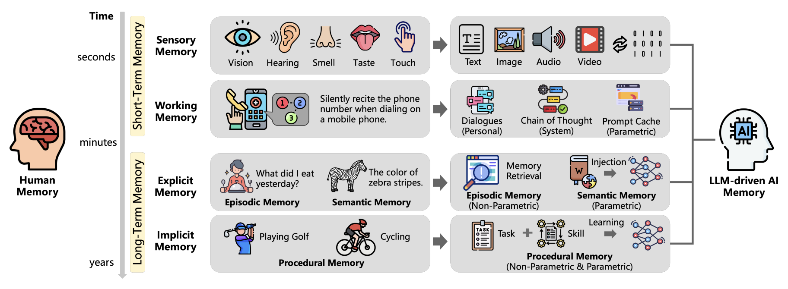

This is a survey of the many ways researchers are trying to give AI systems memory. The authors propose thinking of memory in three dimensions (object, form, and time) as a way to categorize many different approaches researchers are taking.

## Takeaways

- The core idea is to stop classifying memory by time alone. The paper argues memory has three dimensions:
  - **Object**: who or what the memory is about. This splits into _personal_ memory (things about the user, basically your prompts and feedback) and _system_ memory (the AI's own intermediate work, like its chain of thought). I think of system memory as being a bit like short-term working memory.
  - **Form**: how the memory is stored. This splits into _parametric_ memory (baked into the model's weights) and _non-parametric_ memory (external databases). Without fine-tuning, the weights are frozen, so parametric "memories" are in some sense permanent. The database side, whether that's vector stores and RAG or even markdown notes the AI retrieves, is where most of the long-term memory work is happening.
  - **Time**: how long the memory lasts. Prompts and context are effectively short-term.
- A big consequence of memory is identity. Our identity is built out of our memories, and I think an LLM with real memory could presumably start to form an identity too.
- A couple of the future directions stuck with me. Static versus stream memory is basically SSD versus RAM: static memory is great for storing knowledge, but "stream" memory is what lets you adapt in real time. You wouldn't want to use RAG to actively play a video game.
- _Collective_ privacy is a risk I hadn't considered: because AI is sort of a universal aggregator, a compression of patterns, it makes it easier to profile whole _groups_ of people, which is a kind of surveillance.
- My overall feeling is that there's a ton of work out there modeling different kinds of AI memory. Unfortunately, the paper doesn't make it clear how _successful_ any of these approaches actually are.
- The paper has listed a huge number of approaches being taken for different kinds of memory. Notably, the list for episodic memory is huge; this seems to be the holy grail of LLM memory management, and it happens to be the aspect of memory I'm currently really interested in.

## Useful Diagram

This diagram from the paper was really useful in understanding how analogs of human memory map onto LLM memory.

<figure class="h-15">
	
		
	</img-zoom>
	<figcaption>Human and AI minds are pretty related it turns out.</figcaption>
</figure>

## Questions

- Is the best way for AI to manage memory actually to _not_ follow human models? And could you train a separate, specialized neural network whose whole job is managing memory?
- Related to that: has anyone actually tried training a neural network for memory encoding and recall? How would you even do that, and what is the "data"?
- How does adding timestamps to memories change an AI's perception of time?
- What kinds of memories are most responsible for a conscious being's sense of identity? Is it just long-term episodic memory?
- How successful are the various AI-memory approaches right now, and how would you even measure that?
